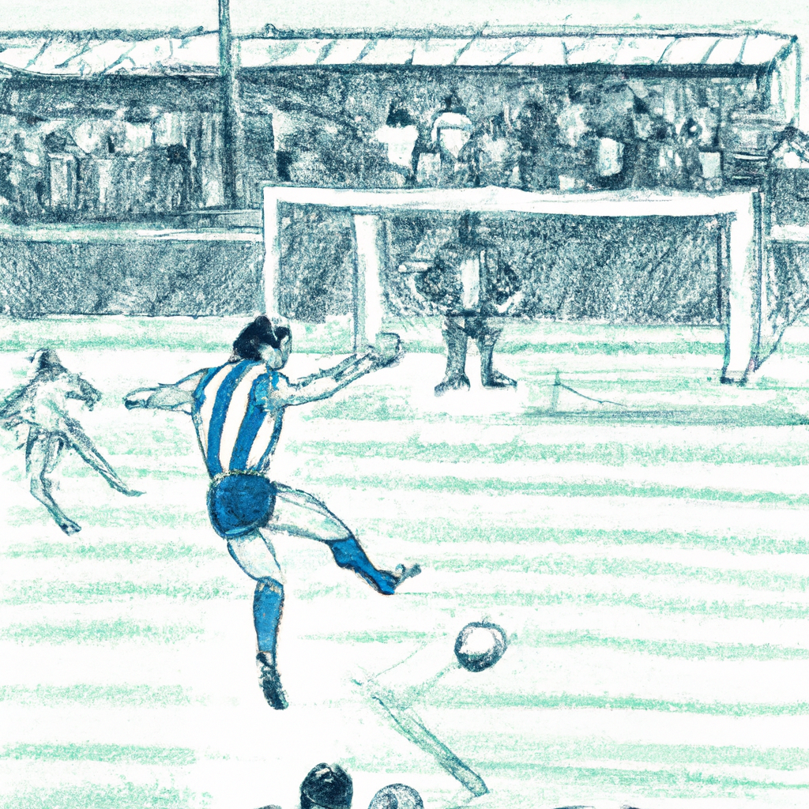
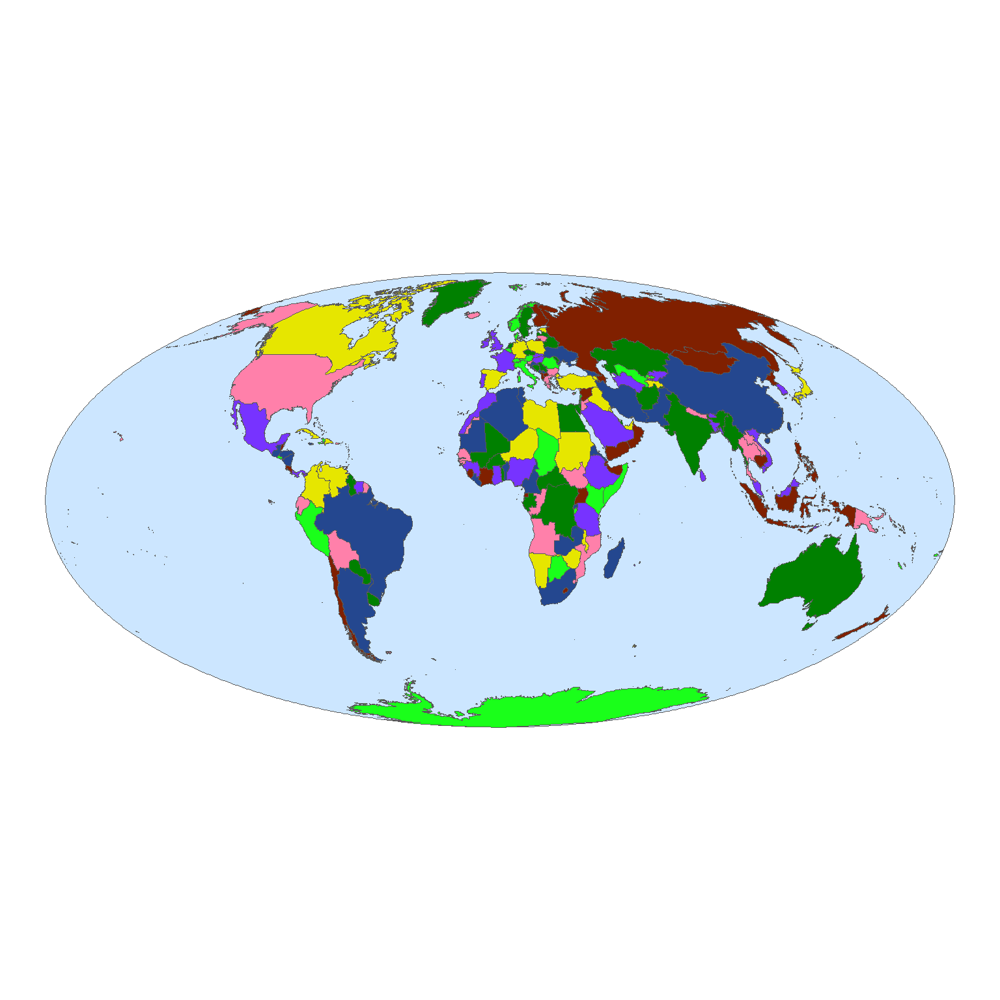
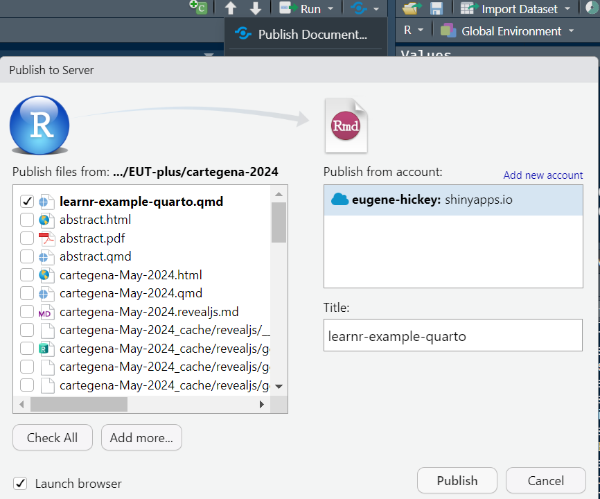
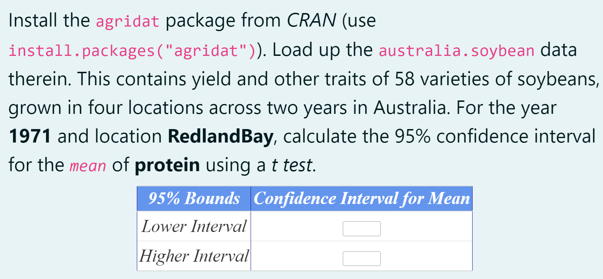
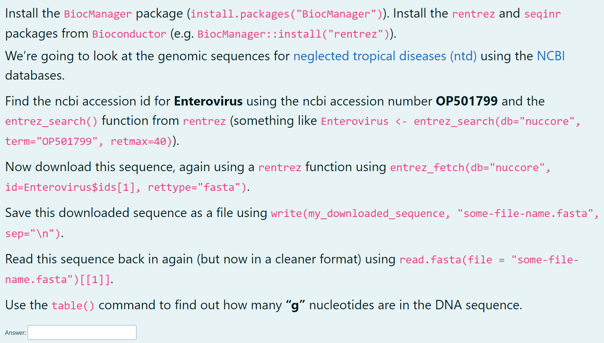

::: {.cell}

:::

::: {.cell}

:::


#  {.title}

::: r-fit-text
R You Ready

[for interactive learning]{.flow}
:::

::: footer
:::

---

:::: {.columns}
::: {.column width="30%"}

### flipbookr {.textcenter}

{width=300}

- Evangeline Reynolds, Garrick Aden-Buie, and Emi Tanaka
- adapted for _quarto_ by Kieran Healy

:::
::: {.column width="30%"}

### learnr {.textcenter}

{width=300}

- Garrick Aden-Buie, Barret Schloerke, JJ Allaire, and Alexander Rossell Hayes

:::
::: {.column width="30%"}

### exams {.textcenter}

{height=300}

- Achim Zeileis, Nikolaus Umlauf, and Friedrich Leisch

:::
::::

<!-- new revealjs slide -->

<!-- # {data-background="images/football.png"} -->

---


::: {.cell layout-align="center"}
::: {.cell-output-display}
{fig-align='center' width=512}
:::
:::


---


::: {.cell}

:::


## flipbookr Runthrough
:::: {.columns  .smallcode  }
:::: {.column width='40%'}
::: {.cell}

```{.r .cell-code}
#es <- understat_league_match_results(league = "La liga", season_start_year = 2021)   #es <- understat_league_match_results(league = "La liga", season_start_year = 2021) |> as_tibble
```
:::
::::
 
:::: {.column width='60%'}
::: {.cell}

:::
::::
:::::

## flipbookr Runthrough
:::: {.columns  .smallcode  }
:::: {.column width='40%'}
::: {.cell}

```{.r .cell-code}
#es <- understat_league_match_results(league = "La liga", season_start_year = 2021) |  #es <- understat_league_match_results(league = "La liga", season_start_year = 2021) |> as_tibble
es
```
:::
::::
 
:::: {.column width='60%'}
::: {.cell}
::: {.cell-output .cell-output-stdout}

```
# A tibble: 380 × 18
   league season match_id isResult home_id home_team home_abbr away_id away_team
   <chr>  <chr>  <chr>    <lgl>    <chr>   <chr>     <chr>     <chr>   <chr>    
 1 La_li… 2021/… 17136    TRUE     146     Valencia  VAL       142     Getafe   
 2 La_li… 2021/… 17138    TRUE     239     Mallorca  MAL       153     Real Bet…
 3 La_li… 2021/… 17139    TRUE     261     Cadiz     CAD       151     Levante  
 4 La_li… 2021/… 17137    TRUE     157     Osasuna   OSA       141     Espanyol 
 5 La_li… 2021/… 17140    TRUE     158     Alaves    ALA       150     Real Mad…
 6 La_li… 2021/… 17141    TRUE     152     Celta Vi… CEL       143     Atletico…
 7 La_li… 2021/… 17142    TRUE     148     Barcelona BAR       140     Real Soc…
 8 La_li… 2021/… 17143    TRUE     138     Sevilla   SEV       145     Rayo Val…
 9 La_li… 2021/… 17144    TRUE     154     Villarre… VIL       155     Granada  
10 La_li… 2021/… 17145    TRUE     207     Elche     ELC       147     Athletic…
# ℹ 370 more rows
# ℹ 9 more variables: away_abbr <chr>, home_goals <dbl>, away_goals <dbl>,
#   home_xG <dbl>, away_xG <dbl>, datetime <chr>, forecast_win <dbl>,
#   forecast_draw <dbl>, forecast_loss <dbl>
```


:::
:::
::::
:::::

## flipbookr Runthrough
:::: {.columns  .smallcode  }
:::: {.column width='40%'}
::: {.cell}

```{.r .cell-code}
#es <- understat_league_match_results(league = "La liga", season_start_year = 2021) |  #es <- understat_league_match_results(league = "La liga", season_start_year = 2021) |> as_tibble
es |>
  filter(year(datetime) == "2022")
```
:::
::::
 
:::: {.column width='60%'}
::: {.cell}
::: {.cell-output .cell-output-stdout}

```
# A tibble: 198 × 18
   league season match_id isResult home_id home_team home_abbr away_id away_team
   <chr>  <chr>  <chr>    <lgl>    <chr>   <chr>     <chr>     <chr>   <chr>    
 1 La_li… 2021/… 17323    TRUE     142     Getafe    GET       150     Real Mad…
 2 La_li… 2021/… 17316    TRUE     207     Elche     ELC       155     Granada  
 3 La_li… 2021/… 17320    TRUE     143     Atletico… ATL       145     Rayo Val…
 4 La_li… 2021/… 17319    TRUE     158     Alaves    ALA       140     Real Soc…
 5 La_li… 2021/… 17321    TRUE     153     Real Bet… BET       152     Celta Vi…
 6 La_li… 2021/… 17322    TRUE     239     Mallorca  MAL       148     Barcelona
 7 La_li… 2021/… 17318    TRUE     154     Villarre… VIL       151     Levante  
 8 La_li… 2021/… 17325    TRUE     157     Osasuna   OSA       147     Athletic…
 9 La_li… 2021/… 17324    TRUE     261     Cadiz     CAD       138     Sevilla  
10 La_li… 2021/… 17329    TRUE     151     Levante   LEV       239     Mallorca 
# ℹ 188 more rows
# ℹ 9 more variables: away_abbr <chr>, home_goals <dbl>, away_goals <dbl>,
#   home_xG <dbl>, away_xG <dbl>, datetime <chr>, forecast_win <dbl>,
#   forecast_draw <dbl>, forecast_loss <dbl>
```


:::
:::
::::
:::::

## flipbookr Runthrough
:::: {.columns  .smallcode  }
:::: {.column width='40%'}
::: {.cell}

```{.r .cell-code}
#es <- understat_league_match_results(league = "La liga", season_start_year = 2021) |  #es <- understat_league_match_results(league = "La liga", season_start_year = 2021) |> as_tibble
es |>
  filter(year(datetime) == "2022") |>
  select(home_team, away_team, home_goals, away_goals, home_xG, away_xG)
```
:::
::::
 
:::: {.column width='60%'}
::: {.cell}
::: {.cell-output .cell-output-stdout}

```
# A tibble: 198 × 6
   home_team       away_team      home_goals away_goals home_xG away_xG
   <chr>           <chr>               <dbl>      <dbl>   <dbl>   <dbl>
 1 Getafe          Real Madrid             1          0   0.900   0.913
 2 Elche           Granada                 0          0   1.45    0.966
 3 Atletico Madrid Rayo Vallecano          2          0   1.98    0.104
 4 Alaves          Real Sociedad           1          1   1.54    1.38 
 5 Real Betis      Celta Vigo              0          2   0.889   1.87 
 6 Mallorca        Barcelona               0          1   0.989   1.62 
 7 Villarreal      Levante                 5          0   4.19    0.423
 8 Osasuna         Athletic Club           1          3   0.522   2.49 
 9 Cadiz           Sevilla                 0          1   0.239   1.28 
10 Levante         Mallorca                2          0   1.32    1.17 
# ℹ 188 more rows
```


:::
:::
::::
:::::

## flipbookr Runthrough
:::: {.columns  .smallcode  }
:::: {.column width='40%'}
::: {.cell}

```{.r .cell-code}
#es <- understat_league_match_results(league = "La liga", season_start_year = 2021) |  #es <- understat_league_match_results(league = "La liga", season_start_year = 2021) |> as_tibble
es |>
  filter(year(datetime) == "2022") |>
  select(home_team, away_team, home_goals, away_goals, home_xG, away_xG) |>
  pivot_longer(-c(home_goals, away_goals, home_xG, away_xG), names_to = "home", values_to = "team")
```
:::
::::
 
:::: {.column width='60%'}
::: {.cell}
::: {.cell-output .cell-output-stdout}

```
# A tibble: 396 × 6
   home_goals away_goals home_xG away_xG home      team           
        <dbl>      <dbl>   <dbl>   <dbl> <chr>     <chr>          
 1          1          0   0.900   0.913 home_team Getafe         
 2          1          0   0.900   0.913 away_team Real Madrid    
 3          0          0   1.45    0.966 home_team Elche          
 4          0          0   1.45    0.966 away_team Granada        
 5          2          0   1.98    0.104 home_team Atletico Madrid
 6          2          0   1.98    0.104 away_team Rayo Vallecano 
 7          1          1   1.54    1.38  home_team Alaves         
 8          1          1   1.54    1.38  away_team Real Sociedad  
 9          0          2   0.889   1.87  home_team Real Betis     
10          0          2   0.889   1.87  away_team Celta Vigo     
# ℹ 386 more rows
```


:::
:::
::::
:::::

## flipbookr Runthrough
:::: {.columns  .smallcode  }
:::: {.column width='40%'}
::: {.cell}

```{.r .cell-code}
#es <- understat_league_match_results(league = "La liga", season_start_year = 2021) |  #es <- understat_league_match_results(league = "La liga", season_start_year = 2021) |> as_tibble
es |>
  filter(year(datetime) == "2022") |>
  select(home_team, away_team, home_goals, away_goals, home_xG, away_xG) |>
  pivot_longer(-c(home_goals, away_goals, home_xG, away_xG), names_to = "home", values_to = "team") |>
  select(team, home, home_goals, away_goals, home_xG, away_xG)
```
:::
::::
 
:::: {.column width='60%'}
::: {.cell}
::: {.cell-output .cell-output-stdout}

```
# A tibble: 396 × 6
   team            home      home_goals away_goals home_xG away_xG
   <chr>           <chr>          <dbl>      <dbl>   <dbl>   <dbl>
 1 Getafe          home_team          1          0   0.900   0.913
 2 Real Madrid     away_team          1          0   0.900   0.913
 3 Elche           home_team          0          0   1.45    0.966
 4 Granada         away_team          0          0   1.45    0.966
 5 Atletico Madrid home_team          2          0   1.98    0.104
 6 Rayo Vallecano  away_team          2          0   1.98    0.104
 7 Alaves          home_team          1          1   1.54    1.38 
 8 Real Sociedad   away_team          1          1   1.54    1.38 
 9 Real Betis      home_team          0          2   0.889   1.87 
10 Celta Vigo      away_team          0          2   0.889   1.87 
# ℹ 386 more rows
```


:::
:::
::::
:::::

## flipbookr Runthrough
:::: {.columns  .smallcode  }
:::: {.column width='40%'}
::: {.cell}

```{.r .cell-code}
#es <- understat_league_match_results(league = "La liga", season_start_year = 2021) |  #es <- understat_league_match_results(league = "La liga", season_start_year = 2021) |> as_tibble
es |>
  filter(year(datetime) == "2022") |>
  select(home_team, away_team, home_goals, away_goals, home_xG, away_xG) |>
  pivot_longer(-c(home_goals, away_goals, home_xG, away_xG), names_to = "home", values_to = "team") |>
  select(team, home, home_goals, away_goals, home_xG, away_xG) |>
  mutate(excess = ifelse(home == "home_team", home_goals - home_xG, away_goals - away_xG))
```
:::
::::
 
:::: {.column width='60%'}
::: {.cell}
::: {.cell-output .cell-output-stdout}

```
# A tibble: 396 × 7
   team            home      home_goals away_goals home_xG away_xG  excess
   <chr>           <chr>          <dbl>      <dbl>   <dbl>   <dbl>   <dbl>
 1 Getafe          home_team          1          0   0.900   0.913  0.100 
 2 Real Madrid     away_team          1          0   0.900   0.913 -0.913 
 3 Elche           home_team          0          0   1.45    0.966 -1.45  
 4 Granada         away_team          0          0   1.45    0.966 -0.966 
 5 Atletico Madrid home_team          2          0   1.98    0.104  0.0190
 6 Rayo Vallecano  away_team          2          0   1.98    0.104 -0.104 
 7 Alaves          home_team          1          1   1.54    1.38  -0.541 
 8 Real Sociedad   away_team          1          1   1.54    1.38  -0.381 
 9 Real Betis      home_team          0          2   0.889   1.87  -0.889 
10 Celta Vigo      away_team          0          2   0.889   1.87   0.128 
# ℹ 386 more rows
```


:::
:::
::::
:::::

## flipbookr Runthrough
:::: {.columns  .smallcode  }
:::: {.column width='40%'}
::: {.cell}

```{.r .cell-code}
#es <- understat_league_match_results(league = "La liga", season_start_year = 2021) |  #es <- understat_league_match_results(league = "La liga", season_start_year = 2021) |> as_tibble
es |>
  filter(year(datetime) == "2022") |>
  select(home_team, away_team, home_goals, away_goals, home_xG, away_xG) |>
  pivot_longer(-c(home_goals, away_goals, home_xG, away_xG), names_to = "home", values_to = "team") |>
  select(team, home, home_goals, away_goals, home_xG, away_xG) |>
  mutate(excess = ifelse(home == "home_team", home_goals - home_xG, away_goals - away_xG)) |>
  group_by(team)
```
:::
::::
 
:::: {.column width='60%'}
::: {.cell}
::: {.cell-output .cell-output-stdout}

```
# A tibble: 396 × 7
# Groups:   team [20]
   team            home      home_goals away_goals home_xG away_xG  excess
   <chr>           <chr>          <dbl>      <dbl>   <dbl>   <dbl>   <dbl>
 1 Getafe          home_team          1          0   0.900   0.913  0.100 
 2 Real Madrid     away_team          1          0   0.900   0.913 -0.913 
 3 Elche           home_team          0          0   1.45    0.966 -1.45  
 4 Granada         away_team          0          0   1.45    0.966 -0.966 
 5 Atletico Madrid home_team          2          0   1.98    0.104  0.0190
 6 Rayo Vallecano  away_team          2          0   1.98    0.104 -0.104 
 7 Alaves          home_team          1          1   1.54    1.38  -0.541 
 8 Real Sociedad   away_team          1          1   1.54    1.38  -0.381 
 9 Real Betis      home_team          0          2   0.889   1.87  -0.889 
10 Celta Vigo      away_team          0          2   0.889   1.87   0.128 
# ℹ 386 more rows
```


:::
:::
::::
:::::

## flipbookr Runthrough
:::: {.columns  .smallcode  }
:::: {.column width='40%'}
::: {.cell}

```{.r .cell-code}
#es <- understat_league_match_results(league = "La liga", season_start_year = 2021) |  #es <- understat_league_match_results(league = "La liga", season_start_year = 2021) |> as_tibble
es |>
  filter(year(datetime) == "2022") |>
  select(home_team, away_team, home_goals, away_goals, home_xG, away_xG) |>
  pivot_longer(-c(home_goals, away_goals, home_xG, away_xG), names_to = "home", values_to = "team") |>
  select(team, home, home_goals, away_goals, home_xG, away_xG) |>
  mutate(excess = ifelse(home == "home_team", home_goals - home_xG, away_goals - away_xG)) |>
  group_by(team) |>
  summarise(excess = mean(excess) |> round(3))
```
:::
::::
 
:::: {.column width='60%'}
::: {.cell}
::: {.cell-output .cell-output-stdout}

```
# A tibble: 20 × 2
   team            excess
   <chr>            <dbl>
 1 Alaves          -0.244
 2 Athletic Club   -0.144
 3 Atletico Madrid  0.275
 4 Barcelona        0.107
 5 Cadiz           -0.185
 6 Celta Vigo      -0.048
 7 Elche            0.093
 8 Espanyol        -0.001
 9 Getafe           0.139
10 Granada         -0.092
11 Levante         -0.121
12 Mallorca        -0.159
13 Osasuna         -0.182
14 Rayo Vallecano  -0.476
15 Real Betis       0.067
16 Real Madrid     -0.301
17 Real Sociedad   -0.706
18 Sevilla          0.013
19 Valencia        -0.013
20 Villarreal      -0.132
```


:::
:::
::::
:::::

## flipbookr Runthrough
:::: {.columns  .smallcode  }
:::: {.column width='40%'}
::: {.cell}

```{.r .cell-code}
#es <- understat_league_match_results(league = "La liga", season_start_year = 2021) |  #es <- understat_league_match_results(league = "La liga", season_start_year = 2021) |> as_tibble
es |>
  filter(year(datetime) == "2022") |>
  select(home_team, away_team, home_goals, away_goals, home_xG, away_xG) |>
  pivot_longer(-c(home_goals, away_goals, home_xG, away_xG), names_to = "home", values_to = "team") |>
  select(team, home, home_goals, away_goals, home_xG, away_xG) |>
  mutate(excess = ifelse(home == "home_team", home_goals - home_xG, away_goals - away_xG)) |>
  group_by(team) |>
  summarise(excess = mean(excess) |> round(3)) |>
  ungroup()
```
:::
::::
 
:::: {.column width='60%'}
::: {.cell}
::: {.cell-output .cell-output-stdout}

```
# A tibble: 20 × 2
   team            excess
   <chr>            <dbl>
 1 Alaves          -0.244
 2 Athletic Club   -0.144
 3 Atletico Madrid  0.275
 4 Barcelona        0.107
 5 Cadiz           -0.185
 6 Celta Vigo      -0.048
 7 Elche            0.093
 8 Espanyol        -0.001
 9 Getafe           0.139
10 Granada         -0.092
11 Levante         -0.121
12 Mallorca        -0.159
13 Osasuna         -0.182
14 Rayo Vallecano  -0.476
15 Real Betis       0.067
16 Real Madrid     -0.301
17 Real Sociedad   -0.706
18 Sevilla          0.013
19 Valencia        -0.013
20 Villarreal      -0.132
```


:::
:::
::::
:::::

## flipbookr Runthrough
:::: {.columns  .smallcode  }
:::: {.column width='40%'}
::: {.cell}

```{.r .cell-code}
#es <- understat_league_match_results(league = "La liga", season_start_year = 2021) |  #es <- understat_league_match_results(league = "La liga", season_start_year = 2021) |> as_tibble
es |>
  filter(year(datetime) == "2022") |>
  select(home_team, away_team, home_goals, away_goals, home_xG, away_xG) |>
  pivot_longer(-c(home_goals, away_goals, home_xG, away_xG), names_to = "home", values_to = "team") |>
  select(team, home, home_goals, away_goals, home_xG, away_xG) |>
  mutate(excess = ifelse(home == "home_team", home_goals - home_xG, away_goals - away_xG)) |>
  group_by(team) |>
  summarise(excess = mean(excess) |> round(3)) |>
  ungroup() |>
  arrange(excess |> desc())
```
:::
::::
 
:::: {.column width='60%'}
::: {.cell}
::: {.cell-output .cell-output-stdout}

```
# A tibble: 20 × 2
   team            excess
   <chr>            <dbl>
 1 Atletico Madrid  0.275
 2 Getafe           0.139
 3 Barcelona        0.107
 4 Elche            0.093
 5 Real Betis       0.067
 6 Sevilla          0.013
 7 Espanyol        -0.001
 8 Valencia        -0.013
 9 Celta Vigo      -0.048
10 Granada         -0.092
11 Levante         -0.121
12 Villarreal      -0.132
13 Athletic Club   -0.144
14 Mallorca        -0.159
15 Osasuna         -0.182
16 Cadiz           -0.185
17 Alaves          -0.244
18 Real Madrid     -0.301
19 Rayo Vallecano  -0.476
20 Real Sociedad   -0.706
```


:::
:::
::::
:::::

## flipbookr Runthrough
:::: {.columns  .smallcode  }
:::: {.column width='40%'}
::: {.cell}

```{.r .cell-code}
#es <- understat_league_match_results(league = "La liga", season_start_year = 2021) |  #es <- understat_league_match_results(league = "La liga", season_start_year = 2021) |> as_tibble
es |>
  filter(year(datetime) == "2022") |>
  select(home_team, away_team, home_goals, away_goals, home_xG, away_xG) |>
  pivot_longer(-c(home_goals, away_goals, home_xG, away_xG), names_to = "home", values_to = "team") |>
  select(team, home, home_goals, away_goals, home_xG, away_xG) |>
  mutate(excess = ifelse(home == "home_team", home_goals - home_xG, away_goals - away_xG)) |>
  group_by(team) |>
  summarise(excess = mean(excess) |> round(3)) |>
  ungroup() |>
  arrange(excess |> desc()) |>
  left_join(teams_meta, by = join_by(team == team_name))
```
:::
::::
 
:::: {.column width='60%'}
::: {.cell}
::: {.cell-output .cell-output-stdout}

```
# A tibble: 20 × 4
   team            excess season    url                                         
   <chr>            <dbl> <chr>     <chr>                                       
 1 Atletico Madrid  0.275 2022/2023 https://understat.com/team/Atletico_Madrid/…
 2 Getafe           0.139 2022/2023 https://understat.com/team/Getafe/2022      
 3 Barcelona        0.107 2022/2023 https://understat.com/team/Barcelona/2022   
 4 Elche            0.093 2022/2023 https://understat.com/team/Elche/2022       
 5 Real Betis       0.067 2022/2023 https://understat.com/team/Real_Betis/2022  
 6 Sevilla          0.013 2022/2023 https://understat.com/team/Sevilla/2022     
 7 Espanyol        -0.001 2022/2023 https://understat.com/team/Espanyol/2022    
 8 Valencia        -0.013 2022/2023 https://understat.com/team/Valencia/2022    
 9 Celta Vigo      -0.048 2022/2023 https://understat.com/team/Celta_Vigo/2022  
10 Granada         -0.092 <NA>      <NA>                                        
11 Levante         -0.121 <NA>      <NA>                                        
12 Villarreal      -0.132 2022/2023 https://understat.com/team/Villarreal/2022  
13 Athletic Club   -0.144 2022/2023 https://understat.com/team/Athletic_Club/20…
14 Mallorca        -0.159 2022/2023 https://understat.com/team/Mallorca/2022    
15 Osasuna         -0.182 2022/2023 https://understat.com/team/Osasuna/2022     
16 Cadiz           -0.185 2022/2023 https://understat.com/team/Cadiz/2022       
17 Alaves          -0.244 <NA>      <NA>                                        
18 Real Madrid     -0.301 2022/2023 https://understat.com/team/Real_Madrid/2022 
19 Rayo Vallecano  -0.476 2022/2023 https://understat.com/team/Rayo_Vallecano/2…
20 Real Sociedad   -0.706 2022/2023 https://understat.com/team/Real_Sociedad/20…
```


:::
:::
::::
:::::

## flipbookr Runthrough
:::: {.columns  .smallcode  }
:::: {.column width='40%'}
::: {.cell}

```{.r .cell-code}
#es <- understat_league_match_results(league = "La liga", season_start_year = 2021) |  #es <- understat_league_match_results(league = "La liga", season_start_year = 2021) |> as_tibble
es |>
  filter(year(datetime) == "2022") |>
  select(home_team, away_team, home_goals, away_goals, home_xG, away_xG) |>
  pivot_longer(-c(home_goals, away_goals, home_xG, away_xG), names_to = "home", values_to = "team") |>
  select(team, home, home_goals, away_goals, home_xG, away_xG) |>
  mutate(excess = ifelse(home == "home_team", home_goals - home_xG, away_goals - away_xG)) |>
  group_by(team) |>
  summarise(excess = mean(excess) |> round(3)) |>
  ungroup() |>
  arrange(excess |> desc()) |>
  left_join(teams_meta, by = join_by(team == team_name)) |>
  drop_na()
```
:::
::::
 
:::: {.column width='60%'}
::: {.cell}
::: {.cell-output .cell-output-stdout}

```
# A tibble: 17 × 4
   team            excess season    url                                         
   <chr>            <dbl> <chr>     <chr>                                       
 1 Atletico Madrid  0.275 2022/2023 https://understat.com/team/Atletico_Madrid/…
 2 Getafe           0.139 2022/2023 https://understat.com/team/Getafe/2022      
 3 Barcelona        0.107 2022/2023 https://understat.com/team/Barcelona/2022   
 4 Elche            0.093 2022/2023 https://understat.com/team/Elche/2022       
 5 Real Betis       0.067 2022/2023 https://understat.com/team/Real_Betis/2022  
 6 Sevilla          0.013 2022/2023 https://understat.com/team/Sevilla/2022     
 7 Espanyol        -0.001 2022/2023 https://understat.com/team/Espanyol/2022    
 8 Valencia        -0.013 2022/2023 https://understat.com/team/Valencia/2022    
 9 Celta Vigo      -0.048 2022/2023 https://understat.com/team/Celta_Vigo/2022  
10 Villarreal      -0.132 2022/2023 https://understat.com/team/Villarreal/2022  
11 Athletic Club   -0.144 2022/2023 https://understat.com/team/Athletic_Club/20…
12 Mallorca        -0.159 2022/2023 https://understat.com/team/Mallorca/2022    
13 Osasuna         -0.182 2022/2023 https://understat.com/team/Osasuna/2022     
14 Cadiz           -0.185 2022/2023 https://understat.com/team/Cadiz/2022       
15 Real Madrid     -0.301 2022/2023 https://understat.com/team/Real_Madrid/2022 
16 Rayo Vallecano  -0.476 2022/2023 https://understat.com/team/Rayo_Vallecano/2…
17 Real Sociedad   -0.706 2022/2023 https://understat.com/team/Real_Sociedad/20…
```


:::
:::
::::
:::::

## flipbookr Runthrough
:::: {.columns  .smallcode  }
:::: {.column width='40%'}
::: {.cell}

```{.r .cell-code}
#es <- understat_league_match_results(league = "La liga", season_start_year = 2021) |  #es <- understat_league_match_results(league = "La liga", season_start_year = 2021) |> as_tibble
es |>
  filter(year(datetime) == "2022") |>
  select(home_team, away_team, home_goals, away_goals, home_xG, away_xG) |>
  pivot_longer(-c(home_goals, away_goals, home_xG, away_xG), names_to = "home", values_to = "team") |>
  select(team, home, home_goals, away_goals, home_xG, away_xG) |>
  mutate(excess = ifelse(home == "home_team", home_goals - home_xG, away_goals - away_xG)) |>
  group_by(team) |>
  summarise(excess = mean(excess) |> round(3)) |>
  ungroup() |>
  arrange(excess |> desc()) |>
  left_join(teams_meta, by = join_by(team == team_name)) |>
  drop_na() |>
  slice(c(1:4, 15:17))
```
:::
::::
 
:::: {.column width='60%'}
::: {.cell}
::: {.cell-output .cell-output-stdout}

```
# A tibble: 7 × 4
  team            excess season    url                                          
  <chr>            <dbl> <chr>     <chr>                                        
1 Atletico Madrid  0.275 2022/2023 https://understat.com/team/Atletico_Madrid/2…
2 Getafe           0.139 2022/2023 https://understat.com/team/Getafe/2022       
3 Barcelona        0.107 2022/2023 https://understat.com/team/Barcelona/2022    
4 Elche            0.093 2022/2023 https://understat.com/team/Elche/2022        
5 Real Madrid     -0.301 2022/2023 https://understat.com/team/Real_Madrid/2022  
6 Rayo Vallecano  -0.476 2022/2023 https://understat.com/team/Rayo_Vallecano/20…
7 Real Sociedad   -0.706 2022/2023 https://understat.com/team/Real_Sociedad/2022
```


:::
:::
::::
:::::

## flipbookr Runthrough
:::: {.columns  .smallcode  }
:::: {.column width='40%'}
::: {.cell}

```{.r .cell-code}
#es <- understat_league_match_results(league = "La liga", season_start_year = 2021) |  #es <- understat_league_match_results(league = "La liga", season_start_year = 2021) |> as_tibble
es |>
  filter(year(datetime) == "2022") |>
  select(home_team, away_team, home_goals, away_goals, home_xG, away_xG) |>
  pivot_longer(-c(home_goals, away_goals, home_xG, away_xG), names_to = "home", values_to = "team") |>
  select(team, home, home_goals, away_goals, home_xG, away_xG) |>
  mutate(excess = ifelse(home == "home_team", home_goals - home_xG, away_goals - away_xG)) |>
  group_by(team) |>
  summarise(excess = mean(excess) |> round(3)) |>
  ungroup() |>
  arrange(excess |> desc()) |>
  left_join(teams_meta, by = join_by(team == team_name)) |>
  drop_na() |>
  slice(c(1:4, 15:17)) |>
  gt()
```
:::
::::
 
:::: {.column width='60%'}
::: {.cell}
::: {.cell-output-display}


```{=html}
<div id="wwwxxogmwn" style="padding-left:0px;padding-right:0px;padding-top:10px;padding-bottom:10px;overflow-x:auto;overflow-y:auto;width:auto;height:auto;">
<style>#wwwxxogmwn table {
  font-family: system-ui, 'Segoe UI', Roboto, Helvetica, Arial, sans-serif, 'Apple Color Emoji', 'Segoe UI Emoji', 'Segoe UI Symbol', 'Noto Color Emoji';
  -webkit-font-smoothing: antialiased;
  -moz-osx-font-smoothing: grayscale;
}

#wwwxxogmwn thead, #wwwxxogmwn tbody, #wwwxxogmwn tfoot, #wwwxxogmwn tr, #wwwxxogmwn td, #wwwxxogmwn th {
  border-style: none;
}

#wwwxxogmwn p {
  margin: 0;
  padding: 0;
}

#wwwxxogmwn .gt_table {
  display: table;
  border-collapse: collapse;
  line-height: normal;
  margin-left: auto;
  margin-right: auto;
  color: #333333;
  font-size: 16px;
  font-weight: normal;
  font-style: normal;
  background-color: #FFFFFF;
  width: auto;
  border-top-style: solid;
  border-top-width: 2px;
  border-top-color: #A8A8A8;
  border-right-style: none;
  border-right-width: 2px;
  border-right-color: #D3D3D3;
  border-bottom-style: solid;
  border-bottom-width: 2px;
  border-bottom-color: #A8A8A8;
  border-left-style: none;
  border-left-width: 2px;
  border-left-color: #D3D3D3;
}

#wwwxxogmwn .gt_caption {
  padding-top: 4px;
  padding-bottom: 4px;
}

#wwwxxogmwn .gt_title {
  color: #333333;
  font-size: 125%;
  font-weight: initial;
  padding-top: 4px;
  padding-bottom: 4px;
  padding-left: 5px;
  padding-right: 5px;
  border-bottom-color: #FFFFFF;
  border-bottom-width: 0;
}

#wwwxxogmwn .gt_subtitle {
  color: #333333;
  font-size: 85%;
  font-weight: initial;
  padding-top: 3px;
  padding-bottom: 5px;
  padding-left: 5px;
  padding-right: 5px;
  border-top-color: #FFFFFF;
  border-top-width: 0;
}

#wwwxxogmwn .gt_heading {
  background-color: #FFFFFF;
  text-align: center;
  border-bottom-color: #FFFFFF;
  border-left-style: none;
  border-left-width: 1px;
  border-left-color: #D3D3D3;
  border-right-style: none;
  border-right-width: 1px;
  border-right-color: #D3D3D3;
}

#wwwxxogmwn .gt_bottom_border {
  border-bottom-style: solid;
  border-bottom-width: 2px;
  border-bottom-color: #D3D3D3;
}

#wwwxxogmwn .gt_col_headings {
  border-top-style: solid;
  border-top-width: 2px;
  border-top-color: #D3D3D3;
  border-bottom-style: solid;
  border-bottom-width: 2px;
  border-bottom-color: #D3D3D3;
  border-left-style: none;
  border-left-width: 1px;
  border-left-color: #D3D3D3;
  border-right-style: none;
  border-right-width: 1px;
  border-right-color: #D3D3D3;
}

#wwwxxogmwn .gt_col_heading {
  color: #333333;
  background-color: #FFFFFF;
  font-size: 100%;
  font-weight: normal;
  text-transform: inherit;
  border-left-style: none;
  border-left-width: 1px;
  border-left-color: #D3D3D3;
  border-right-style: none;
  border-right-width: 1px;
  border-right-color: #D3D3D3;
  vertical-align: bottom;
  padding-top: 5px;
  padding-bottom: 6px;
  padding-left: 5px;
  padding-right: 5px;
  overflow-x: hidden;
}

#wwwxxogmwn .gt_column_spanner_outer {
  color: #333333;
  background-color: #FFFFFF;
  font-size: 100%;
  font-weight: normal;
  text-transform: inherit;
  padding-top: 0;
  padding-bottom: 0;
  padding-left: 4px;
  padding-right: 4px;
}

#wwwxxogmwn .gt_column_spanner_outer:first-child {
  padding-left: 0;
}

#wwwxxogmwn .gt_column_spanner_outer:last-child {
  padding-right: 0;
}

#wwwxxogmwn .gt_column_spanner {
  border-bottom-style: solid;
  border-bottom-width: 2px;
  border-bottom-color: #D3D3D3;
  vertical-align: bottom;
  padding-top: 5px;
  padding-bottom: 5px;
  overflow-x: hidden;
  display: inline-block;
  width: 100%;
}

#wwwxxogmwn .gt_spanner_row {
  border-bottom-style: hidden;
}

#wwwxxogmwn .gt_group_heading {
  padding-top: 8px;
  padding-bottom: 8px;
  padding-left: 5px;
  padding-right: 5px;
  color: #333333;
  background-color: #FFFFFF;
  font-size: 100%;
  font-weight: initial;
  text-transform: inherit;
  border-top-style: solid;
  border-top-width: 2px;
  border-top-color: #D3D3D3;
  border-bottom-style: solid;
  border-bottom-width: 2px;
  border-bottom-color: #D3D3D3;
  border-left-style: none;
  border-left-width: 1px;
  border-left-color: #D3D3D3;
  border-right-style: none;
  border-right-width: 1px;
  border-right-color: #D3D3D3;
  vertical-align: middle;
  text-align: left;
}

#wwwxxogmwn .gt_empty_group_heading {
  padding: 0.5px;
  color: #333333;
  background-color: #FFFFFF;
  font-size: 100%;
  font-weight: initial;
  border-top-style: solid;
  border-top-width: 2px;
  border-top-color: #D3D3D3;
  border-bottom-style: solid;
  border-bottom-width: 2px;
  border-bottom-color: #D3D3D3;
  vertical-align: middle;
}

#wwwxxogmwn .gt_from_md > :first-child {
  margin-top: 0;
}

#wwwxxogmwn .gt_from_md > :last-child {
  margin-bottom: 0;
}

#wwwxxogmwn .gt_row {
  padding-top: 8px;
  padding-bottom: 8px;
  padding-left: 5px;
  padding-right: 5px;
  margin: 10px;
  border-top-style: solid;
  border-top-width: 1px;
  border-top-color: #D3D3D3;
  border-left-style: none;
  border-left-width: 1px;
  border-left-color: #D3D3D3;
  border-right-style: none;
  border-right-width: 1px;
  border-right-color: #D3D3D3;
  vertical-align: middle;
  overflow-x: hidden;
}

#wwwxxogmwn .gt_stub {
  color: #333333;
  background-color: #FFFFFF;
  font-size: 100%;
  font-weight: initial;
  text-transform: inherit;
  border-right-style: solid;
  border-right-width: 2px;
  border-right-color: #D3D3D3;
  padding-left: 5px;
  padding-right: 5px;
}

#wwwxxogmwn .gt_stub_row_group {
  color: #333333;
  background-color: #FFFFFF;
  font-size: 100%;
  font-weight: initial;
  text-transform: inherit;
  border-right-style: solid;
  border-right-width: 2px;
  border-right-color: #D3D3D3;
  padding-left: 5px;
  padding-right: 5px;
  vertical-align: top;
}

#wwwxxogmwn .gt_row_group_first td {
  border-top-width: 2px;
}

#wwwxxogmwn .gt_row_group_first th {
  border-top-width: 2px;
}

#wwwxxogmwn .gt_summary_row {
  color: #333333;
  background-color: #FFFFFF;
  text-transform: inherit;
  padding-top: 8px;
  padding-bottom: 8px;
  padding-left: 5px;
  padding-right: 5px;
}

#wwwxxogmwn .gt_first_summary_row {
  border-top-style: solid;
  border-top-color: #D3D3D3;
}

#wwwxxogmwn .gt_first_summary_row.thick {
  border-top-width: 2px;
}

#wwwxxogmwn .gt_last_summary_row {
  padding-top: 8px;
  padding-bottom: 8px;
  padding-left: 5px;
  padding-right: 5px;
  border-bottom-style: solid;
  border-bottom-width: 2px;
  border-bottom-color: #D3D3D3;
}

#wwwxxogmwn .gt_grand_summary_row {
  color: #333333;
  background-color: #FFFFFF;
  text-transform: inherit;
  padding-top: 8px;
  padding-bottom: 8px;
  padding-left: 5px;
  padding-right: 5px;
}

#wwwxxogmwn .gt_first_grand_summary_row {
  padding-top: 8px;
  padding-bottom: 8px;
  padding-left: 5px;
  padding-right: 5px;
  border-top-style: double;
  border-top-width: 6px;
  border-top-color: #D3D3D3;
}

#wwwxxogmwn .gt_last_grand_summary_row_top {
  padding-top: 8px;
  padding-bottom: 8px;
  padding-left: 5px;
  padding-right: 5px;
  border-bottom-style: double;
  border-bottom-width: 6px;
  border-bottom-color: #D3D3D3;
}

#wwwxxogmwn .gt_striped {
  background-color: rgba(128, 128, 128, 0.05);
}

#wwwxxogmwn .gt_table_body {
  border-top-style: solid;
  border-top-width: 2px;
  border-top-color: #D3D3D3;
  border-bottom-style: solid;
  border-bottom-width: 2px;
  border-bottom-color: #D3D3D3;
}

#wwwxxogmwn .gt_footnotes {
  color: #333333;
  background-color: #FFFFFF;
  border-bottom-style: none;
  border-bottom-width: 2px;
  border-bottom-color: #D3D3D3;
  border-left-style: none;
  border-left-width: 2px;
  border-left-color: #D3D3D3;
  border-right-style: none;
  border-right-width: 2px;
  border-right-color: #D3D3D3;
}

#wwwxxogmwn .gt_footnote {
  margin: 0px;
  font-size: 90%;
  padding-top: 4px;
  padding-bottom: 4px;
  padding-left: 5px;
  padding-right: 5px;
}

#wwwxxogmwn .gt_sourcenotes {
  color: #333333;
  background-color: #FFFFFF;
  border-bottom-style: none;
  border-bottom-width: 2px;
  border-bottom-color: #D3D3D3;
  border-left-style: none;
  border-left-width: 2px;
  border-left-color: #D3D3D3;
  border-right-style: none;
  border-right-width: 2px;
  border-right-color: #D3D3D3;
}

#wwwxxogmwn .gt_sourcenote {
  font-size: 90%;
  padding-top: 4px;
  padding-bottom: 4px;
  padding-left: 5px;
  padding-right: 5px;
}

#wwwxxogmwn .gt_left {
  text-align: left;
}

#wwwxxogmwn .gt_center {
  text-align: center;
}

#wwwxxogmwn .gt_right {
  text-align: right;
  font-variant-numeric: tabular-nums;
}

#wwwxxogmwn .gt_font_normal {
  font-weight: normal;
}

#wwwxxogmwn .gt_font_bold {
  font-weight: bold;
}

#wwwxxogmwn .gt_font_italic {
  font-style: italic;
}

#wwwxxogmwn .gt_super {
  font-size: 65%;
}

#wwwxxogmwn .gt_footnote_marks {
  font-size: 75%;
  vertical-align: 0.4em;
  position: initial;
}

#wwwxxogmwn .gt_asterisk {
  font-size: 100%;
  vertical-align: 0;
}

#wwwxxogmwn .gt_indent_1 {
  text-indent: 5px;
}

#wwwxxogmwn .gt_indent_2 {
  text-indent: 10px;
}

#wwwxxogmwn .gt_indent_3 {
  text-indent: 15px;
}

#wwwxxogmwn .gt_indent_4 {
  text-indent: 20px;
}

#wwwxxogmwn .gt_indent_5 {
  text-indent: 25px;
}
</style>
<table class="gt_table" data-quarto-disable-processing="false" data-quarto-bootstrap="false">
  <thead>
    <tr class="gt_col_headings">
      <th class="gt_col_heading gt_columns_bottom_border gt_left" rowspan="1" colspan="1" scope="col" id="team">team</th>
      <th class="gt_col_heading gt_columns_bottom_border gt_right" rowspan="1" colspan="1" scope="col" id="excess">excess</th>
      <th class="gt_col_heading gt_columns_bottom_border gt_right" rowspan="1" colspan="1" scope="col" id="season">season</th>
      <th class="gt_col_heading gt_columns_bottom_border gt_left" rowspan="1" colspan="1" scope="col" id="url">url</th>
    </tr>
  </thead>
  <tbody class="gt_table_body">
    <tr><td headers="team" class="gt_row gt_left">Atletico Madrid</td>
<td headers="excess" class="gt_row gt_right">0.275</td>
<td headers="season" class="gt_row gt_right">2022/2023</td>
<td headers="url" class="gt_row gt_left">https://understat.com/team/Atletico_Madrid/2022</td></tr>
    <tr><td headers="team" class="gt_row gt_left">Getafe</td>
<td headers="excess" class="gt_row gt_right">0.139</td>
<td headers="season" class="gt_row gt_right">2022/2023</td>
<td headers="url" class="gt_row gt_left">https://understat.com/team/Getafe/2022</td></tr>
    <tr><td headers="team" class="gt_row gt_left">Barcelona</td>
<td headers="excess" class="gt_row gt_right">0.107</td>
<td headers="season" class="gt_row gt_right">2022/2023</td>
<td headers="url" class="gt_row gt_left">https://understat.com/team/Barcelona/2022</td></tr>
    <tr><td headers="team" class="gt_row gt_left">Elche</td>
<td headers="excess" class="gt_row gt_right">0.093</td>
<td headers="season" class="gt_row gt_right">2022/2023</td>
<td headers="url" class="gt_row gt_left">https://understat.com/team/Elche/2022</td></tr>
    <tr><td headers="team" class="gt_row gt_left">Real Madrid</td>
<td headers="excess" class="gt_row gt_right">-0.301</td>
<td headers="season" class="gt_row gt_right">2022/2023</td>
<td headers="url" class="gt_row gt_left">https://understat.com/team/Real_Madrid/2022</td></tr>
    <tr><td headers="team" class="gt_row gt_left">Rayo Vallecano</td>
<td headers="excess" class="gt_row gt_right">-0.476</td>
<td headers="season" class="gt_row gt_right">2022/2023</td>
<td headers="url" class="gt_row gt_left">https://understat.com/team/Rayo_Vallecano/2022</td></tr>
    <tr><td headers="team" class="gt_row gt_left">Real Sociedad</td>
<td headers="excess" class="gt_row gt_right">-0.706</td>
<td headers="season" class="gt_row gt_right">2022/2023</td>
<td headers="url" class="gt_row gt_left">https://understat.com/team/Real_Sociedad/2022</td></tr>
  </tbody>
  
  
</table>
</div>
```


:::
:::
::::
:::::

## flipbookr Runthrough
:::: {.columns  .smallcode  }
:::: {.column width='40%'}
::: {.cell}

```{.r .cell-code}
#es <- understat_league_match_results(league = "La liga", season_start_year = 2021) |  #es <- understat_league_match_results(league = "La liga", season_start_year = 2021) |> as_tibble
es |>
  filter(year(datetime) == "2022") |>
  select(home_team, away_team, home_goals, away_goals, home_xG, away_xG) |>
  pivot_longer(-c(home_goals, away_goals, home_xG, away_xG), names_to = "home", values_to = "team") |>
  select(team, home, home_goals, away_goals, home_xG, away_xG) |>
  mutate(excess = ifelse(home == "home_team", home_goals - home_xG, away_goals - away_xG)) |>
  group_by(team) |>
  summarise(excess = mean(excess) |> round(3)) |>
  ungroup() |>
  arrange(excess |> desc()) |>
  left_join(teams_meta, by = join_by(team == team_name)) |>
  drop_na() |>
  slice(c(1:4, 15:17)) |>
  gt() |>
  cols_label(team = "Team",
             excess = "Goal Excess",
             season = "Season",
             url = "Club Website")
```
:::
::::
 
:::: {.column width='60%'}
::: {.cell}
::: {.cell-output-display}


```{=html}
<div id="wzrxxqmkri" style="padding-left:0px;padding-right:0px;padding-top:10px;padding-bottom:10px;overflow-x:auto;overflow-y:auto;width:auto;height:auto;">
<style>#wzrxxqmkri table {
  font-family: system-ui, 'Segoe UI', Roboto, Helvetica, Arial, sans-serif, 'Apple Color Emoji', 'Segoe UI Emoji', 'Segoe UI Symbol', 'Noto Color Emoji';
  -webkit-font-smoothing: antialiased;
  -moz-osx-font-smoothing: grayscale;
}

#wzrxxqmkri thead, #wzrxxqmkri tbody, #wzrxxqmkri tfoot, #wzrxxqmkri tr, #wzrxxqmkri td, #wzrxxqmkri th {
  border-style: none;
}

#wzrxxqmkri p {
  margin: 0;
  padding: 0;
}

#wzrxxqmkri .gt_table {
  display: table;
  border-collapse: collapse;
  line-height: normal;
  margin-left: auto;
  margin-right: auto;
  color: #333333;
  font-size: 16px;
  font-weight: normal;
  font-style: normal;
  background-color: #FFFFFF;
  width: auto;
  border-top-style: solid;
  border-top-width: 2px;
  border-top-color: #A8A8A8;
  border-right-style: none;
  border-right-width: 2px;
  border-right-color: #D3D3D3;
  border-bottom-style: solid;
  border-bottom-width: 2px;
  border-bottom-color: #A8A8A8;
  border-left-style: none;
  border-left-width: 2px;
  border-left-color: #D3D3D3;
}

#wzrxxqmkri .gt_caption {
  padding-top: 4px;
  padding-bottom: 4px;
}

#wzrxxqmkri .gt_title {
  color: #333333;
  font-size: 125%;
  font-weight: initial;
  padding-top: 4px;
  padding-bottom: 4px;
  padding-left: 5px;
  padding-right: 5px;
  border-bottom-color: #FFFFFF;
  border-bottom-width: 0;
}

#wzrxxqmkri .gt_subtitle {
  color: #333333;
  font-size: 85%;
  font-weight: initial;
  padding-top: 3px;
  padding-bottom: 5px;
  padding-left: 5px;
  padding-right: 5px;
  border-top-color: #FFFFFF;
  border-top-width: 0;
}

#wzrxxqmkri .gt_heading {
  background-color: #FFFFFF;
  text-align: center;
  border-bottom-color: #FFFFFF;
  border-left-style: none;
  border-left-width: 1px;
  border-left-color: #D3D3D3;
  border-right-style: none;
  border-right-width: 1px;
  border-right-color: #D3D3D3;
}

#wzrxxqmkri .gt_bottom_border {
  border-bottom-style: solid;
  border-bottom-width: 2px;
  border-bottom-color: #D3D3D3;
}

#wzrxxqmkri .gt_col_headings {
  border-top-style: solid;
  border-top-width: 2px;
  border-top-color: #D3D3D3;
  border-bottom-style: solid;
  border-bottom-width: 2px;
  border-bottom-color: #D3D3D3;
  border-left-style: none;
  border-left-width: 1px;
  border-left-color: #D3D3D3;
  border-right-style: none;
  border-right-width: 1px;
  border-right-color: #D3D3D3;
}

#wzrxxqmkri .gt_col_heading {
  color: #333333;
  background-color: #FFFFFF;
  font-size: 100%;
  font-weight: normal;
  text-transform: inherit;
  border-left-style: none;
  border-left-width: 1px;
  border-left-color: #D3D3D3;
  border-right-style: none;
  border-right-width: 1px;
  border-right-color: #D3D3D3;
  vertical-align: bottom;
  padding-top: 5px;
  padding-bottom: 6px;
  padding-left: 5px;
  padding-right: 5px;
  overflow-x: hidden;
}

#wzrxxqmkri .gt_column_spanner_outer {
  color: #333333;
  background-color: #FFFFFF;
  font-size: 100%;
  font-weight: normal;
  text-transform: inherit;
  padding-top: 0;
  padding-bottom: 0;
  padding-left: 4px;
  padding-right: 4px;
}

#wzrxxqmkri .gt_column_spanner_outer:first-child {
  padding-left: 0;
}

#wzrxxqmkri .gt_column_spanner_outer:last-child {
  padding-right: 0;
}

#wzrxxqmkri .gt_column_spanner {
  border-bottom-style: solid;
  border-bottom-width: 2px;
  border-bottom-color: #D3D3D3;
  vertical-align: bottom;
  padding-top: 5px;
  padding-bottom: 5px;
  overflow-x: hidden;
  display: inline-block;
  width: 100%;
}

#wzrxxqmkri .gt_spanner_row {
  border-bottom-style: hidden;
}

#wzrxxqmkri .gt_group_heading {
  padding-top: 8px;
  padding-bottom: 8px;
  padding-left: 5px;
  padding-right: 5px;
  color: #333333;
  background-color: #FFFFFF;
  font-size: 100%;
  font-weight: initial;
  text-transform: inherit;
  border-top-style: solid;
  border-top-width: 2px;
  border-top-color: #D3D3D3;
  border-bottom-style: solid;
  border-bottom-width: 2px;
  border-bottom-color: #D3D3D3;
  border-left-style: none;
  border-left-width: 1px;
  border-left-color: #D3D3D3;
  border-right-style: none;
  border-right-width: 1px;
  border-right-color: #D3D3D3;
  vertical-align: middle;
  text-align: left;
}

#wzrxxqmkri .gt_empty_group_heading {
  padding: 0.5px;
  color: #333333;
  background-color: #FFFFFF;
  font-size: 100%;
  font-weight: initial;
  border-top-style: solid;
  border-top-width: 2px;
  border-top-color: #D3D3D3;
  border-bottom-style: solid;
  border-bottom-width: 2px;
  border-bottom-color: #D3D3D3;
  vertical-align: middle;
}

#wzrxxqmkri .gt_from_md > :first-child {
  margin-top: 0;
}

#wzrxxqmkri .gt_from_md > :last-child {
  margin-bottom: 0;
}

#wzrxxqmkri .gt_row {
  padding-top: 8px;
  padding-bottom: 8px;
  padding-left: 5px;
  padding-right: 5px;
  margin: 10px;
  border-top-style: solid;
  border-top-width: 1px;
  border-top-color: #D3D3D3;
  border-left-style: none;
  border-left-width: 1px;
  border-left-color: #D3D3D3;
  border-right-style: none;
  border-right-width: 1px;
  border-right-color: #D3D3D3;
  vertical-align: middle;
  overflow-x: hidden;
}

#wzrxxqmkri .gt_stub {
  color: #333333;
  background-color: #FFFFFF;
  font-size: 100%;
  font-weight: initial;
  text-transform: inherit;
  border-right-style: solid;
  border-right-width: 2px;
  border-right-color: #D3D3D3;
  padding-left: 5px;
  padding-right: 5px;
}

#wzrxxqmkri .gt_stub_row_group {
  color: #333333;
  background-color: #FFFFFF;
  font-size: 100%;
  font-weight: initial;
  text-transform: inherit;
  border-right-style: solid;
  border-right-width: 2px;
  border-right-color: #D3D3D3;
  padding-left: 5px;
  padding-right: 5px;
  vertical-align: top;
}

#wzrxxqmkri .gt_row_group_first td {
  border-top-width: 2px;
}

#wzrxxqmkri .gt_row_group_first th {
  border-top-width: 2px;
}

#wzrxxqmkri .gt_summary_row {
  color: #333333;
  background-color: #FFFFFF;
  text-transform: inherit;
  padding-top: 8px;
  padding-bottom: 8px;
  padding-left: 5px;
  padding-right: 5px;
}

#wzrxxqmkri .gt_first_summary_row {
  border-top-style: solid;
  border-top-color: #D3D3D3;
}

#wzrxxqmkri .gt_first_summary_row.thick {
  border-top-width: 2px;
}

#wzrxxqmkri .gt_last_summary_row {
  padding-top: 8px;
  padding-bottom: 8px;
  padding-left: 5px;
  padding-right: 5px;
  border-bottom-style: solid;
  border-bottom-width: 2px;
  border-bottom-color: #D3D3D3;
}

#wzrxxqmkri .gt_grand_summary_row {
  color: #333333;
  background-color: #FFFFFF;
  text-transform: inherit;
  padding-top: 8px;
  padding-bottom: 8px;
  padding-left: 5px;
  padding-right: 5px;
}

#wzrxxqmkri .gt_first_grand_summary_row {
  padding-top: 8px;
  padding-bottom: 8px;
  padding-left: 5px;
  padding-right: 5px;
  border-top-style: double;
  border-top-width: 6px;
  border-top-color: #D3D3D3;
}

#wzrxxqmkri .gt_last_grand_summary_row_top {
  padding-top: 8px;
  padding-bottom: 8px;
  padding-left: 5px;
  padding-right: 5px;
  border-bottom-style: double;
  border-bottom-width: 6px;
  border-bottom-color: #D3D3D3;
}

#wzrxxqmkri .gt_striped {
  background-color: rgba(128, 128, 128, 0.05);
}

#wzrxxqmkri .gt_table_body {
  border-top-style: solid;
  border-top-width: 2px;
  border-top-color: #D3D3D3;
  border-bottom-style: solid;
  border-bottom-width: 2px;
  border-bottom-color: #D3D3D3;
}

#wzrxxqmkri .gt_footnotes {
  color: #333333;
  background-color: #FFFFFF;
  border-bottom-style: none;
  border-bottom-width: 2px;
  border-bottom-color: #D3D3D3;
  border-left-style: none;
  border-left-width: 2px;
  border-left-color: #D3D3D3;
  border-right-style: none;
  border-right-width: 2px;
  border-right-color: #D3D3D3;
}

#wzrxxqmkri .gt_footnote {
  margin: 0px;
  font-size: 90%;
  padding-top: 4px;
  padding-bottom: 4px;
  padding-left: 5px;
  padding-right: 5px;
}

#wzrxxqmkri .gt_sourcenotes {
  color: #333333;
  background-color: #FFFFFF;
  border-bottom-style: none;
  border-bottom-width: 2px;
  border-bottom-color: #D3D3D3;
  border-left-style: none;
  border-left-width: 2px;
  border-left-color: #D3D3D3;
  border-right-style: none;
  border-right-width: 2px;
  border-right-color: #D3D3D3;
}

#wzrxxqmkri .gt_sourcenote {
  font-size: 90%;
  padding-top: 4px;
  padding-bottom: 4px;
  padding-left: 5px;
  padding-right: 5px;
}

#wzrxxqmkri .gt_left {
  text-align: left;
}

#wzrxxqmkri .gt_center {
  text-align: center;
}

#wzrxxqmkri .gt_right {
  text-align: right;
  font-variant-numeric: tabular-nums;
}

#wzrxxqmkri .gt_font_normal {
  font-weight: normal;
}

#wzrxxqmkri .gt_font_bold {
  font-weight: bold;
}

#wzrxxqmkri .gt_font_italic {
  font-style: italic;
}

#wzrxxqmkri .gt_super {
  font-size: 65%;
}

#wzrxxqmkri .gt_footnote_marks {
  font-size: 75%;
  vertical-align: 0.4em;
  position: initial;
}

#wzrxxqmkri .gt_asterisk {
  font-size: 100%;
  vertical-align: 0;
}

#wzrxxqmkri .gt_indent_1 {
  text-indent: 5px;
}

#wzrxxqmkri .gt_indent_2 {
  text-indent: 10px;
}

#wzrxxqmkri .gt_indent_3 {
  text-indent: 15px;
}

#wzrxxqmkri .gt_indent_4 {
  text-indent: 20px;
}

#wzrxxqmkri .gt_indent_5 {
  text-indent: 25px;
}
</style>
<table class="gt_table" data-quarto-disable-processing="false" data-quarto-bootstrap="false">
  <thead>
    <tr class="gt_col_headings">
      <th class="gt_col_heading gt_columns_bottom_border gt_left" rowspan="1" colspan="1" scope="col" id="Team">Team</th>
      <th class="gt_col_heading gt_columns_bottom_border gt_right" rowspan="1" colspan="1" scope="col" id="Goal Excess">Goal Excess</th>
      <th class="gt_col_heading gt_columns_bottom_border gt_right" rowspan="1" colspan="1" scope="col" id="Season">Season</th>
      <th class="gt_col_heading gt_columns_bottom_border gt_left" rowspan="1" colspan="1" scope="col" id="Club Website">Club Website</th>
    </tr>
  </thead>
  <tbody class="gt_table_body">
    <tr><td headers="team" class="gt_row gt_left">Atletico Madrid</td>
<td headers="excess" class="gt_row gt_right">0.275</td>
<td headers="season" class="gt_row gt_right">2022/2023</td>
<td headers="url" class="gt_row gt_left">https://understat.com/team/Atletico_Madrid/2022</td></tr>
    <tr><td headers="team" class="gt_row gt_left">Getafe</td>
<td headers="excess" class="gt_row gt_right">0.139</td>
<td headers="season" class="gt_row gt_right">2022/2023</td>
<td headers="url" class="gt_row gt_left">https://understat.com/team/Getafe/2022</td></tr>
    <tr><td headers="team" class="gt_row gt_left">Barcelona</td>
<td headers="excess" class="gt_row gt_right">0.107</td>
<td headers="season" class="gt_row gt_right">2022/2023</td>
<td headers="url" class="gt_row gt_left">https://understat.com/team/Barcelona/2022</td></tr>
    <tr><td headers="team" class="gt_row gt_left">Elche</td>
<td headers="excess" class="gt_row gt_right">0.093</td>
<td headers="season" class="gt_row gt_right">2022/2023</td>
<td headers="url" class="gt_row gt_left">https://understat.com/team/Elche/2022</td></tr>
    <tr><td headers="team" class="gt_row gt_left">Real Madrid</td>
<td headers="excess" class="gt_row gt_right">-0.301</td>
<td headers="season" class="gt_row gt_right">2022/2023</td>
<td headers="url" class="gt_row gt_left">https://understat.com/team/Real_Madrid/2022</td></tr>
    <tr><td headers="team" class="gt_row gt_left">Rayo Vallecano</td>
<td headers="excess" class="gt_row gt_right">-0.476</td>
<td headers="season" class="gt_row gt_right">2022/2023</td>
<td headers="url" class="gt_row gt_left">https://understat.com/team/Rayo_Vallecano/2022</td></tr>
    <tr><td headers="team" class="gt_row gt_left">Real Sociedad</td>
<td headers="excess" class="gt_row gt_right">-0.706</td>
<td headers="season" class="gt_row gt_right">2022/2023</td>
<td headers="url" class="gt_row gt_left">https://understat.com/team/Real_Sociedad/2022</td></tr>
  </tbody>
  
  
</table>
</div>
```


:::
:::
::::
:::::

## flipbookr Runthrough
:::: {.columns  .smallcode  }
:::: {.column width='40%'}
::: {.cell}

```{.r .cell-code}
#es <- understat_league_match_results(league = "La liga", season_start_year = 2021) |  #es <- understat_league_match_results(league = "La liga", season_start_year = 2021) |> as_tibble
es |>
  filter(year(datetime) == "2022") |>
  select(home_team, away_team, home_goals, away_goals, home_xG, away_xG) |>
  pivot_longer(-c(home_goals, away_goals, home_xG, away_xG), names_to = "home", values_to = "team") |>
  select(team, home, home_goals, away_goals, home_xG, away_xG) |>
  mutate(excess = ifelse(home == "home_team", home_goals - home_xG, away_goals - away_xG)) |>
  group_by(team) |>
  summarise(excess = mean(excess) |> round(3)) |>
  ungroup() |>
  arrange(excess |> desc()) |>
  left_join(teams_meta, by = join_by(team == team_name)) |>
  drop_na() |>
  slice(c(1:4, 15:17)) |>
  gt() |>
  cols_label(team = "Team",
             excess = "Goal Excess",
             season = "Season",
             url = "Club Website") |>
  cols_align(align = "center")
```
:::
::::
 
:::: {.column width='60%'}
::: {.cell}
::: {.cell-output-display}


```{=html}
<div id="qmmqpcifub" style="padding-left:0px;padding-right:0px;padding-top:10px;padding-bottom:10px;overflow-x:auto;overflow-y:auto;width:auto;height:auto;">
<style>#qmmqpcifub table {
  font-family: system-ui, 'Segoe UI', Roboto, Helvetica, Arial, sans-serif, 'Apple Color Emoji', 'Segoe UI Emoji', 'Segoe UI Symbol', 'Noto Color Emoji';
  -webkit-font-smoothing: antialiased;
  -moz-osx-font-smoothing: grayscale;
}

#qmmqpcifub thead, #qmmqpcifub tbody, #qmmqpcifub tfoot, #qmmqpcifub tr, #qmmqpcifub td, #qmmqpcifub th {
  border-style: none;
}

#qmmqpcifub p {
  margin: 0;
  padding: 0;
}

#qmmqpcifub .gt_table {
  display: table;
  border-collapse: collapse;
  line-height: normal;
  margin-left: auto;
  margin-right: auto;
  color: #333333;
  font-size: 16px;
  font-weight: normal;
  font-style: normal;
  background-color: #FFFFFF;
  width: auto;
  border-top-style: solid;
  border-top-width: 2px;
  border-top-color: #A8A8A8;
  border-right-style: none;
  border-right-width: 2px;
  border-right-color: #D3D3D3;
  border-bottom-style: solid;
  border-bottom-width: 2px;
  border-bottom-color: #A8A8A8;
  border-left-style: none;
  border-left-width: 2px;
  border-left-color: #D3D3D3;
}

#qmmqpcifub .gt_caption {
  padding-top: 4px;
  padding-bottom: 4px;
}

#qmmqpcifub .gt_title {
  color: #333333;
  font-size: 125%;
  font-weight: initial;
  padding-top: 4px;
  padding-bottom: 4px;
  padding-left: 5px;
  padding-right: 5px;
  border-bottom-color: #FFFFFF;
  border-bottom-width: 0;
}

#qmmqpcifub .gt_subtitle {
  color: #333333;
  font-size: 85%;
  font-weight: initial;
  padding-top: 3px;
  padding-bottom: 5px;
  padding-left: 5px;
  padding-right: 5px;
  border-top-color: #FFFFFF;
  border-top-width: 0;
}

#qmmqpcifub .gt_heading {
  background-color: #FFFFFF;
  text-align: center;
  border-bottom-color: #FFFFFF;
  border-left-style: none;
  border-left-width: 1px;
  border-left-color: #D3D3D3;
  border-right-style: none;
  border-right-width: 1px;
  border-right-color: #D3D3D3;
}

#qmmqpcifub .gt_bottom_border {
  border-bottom-style: solid;
  border-bottom-width: 2px;
  border-bottom-color: #D3D3D3;
}

#qmmqpcifub .gt_col_headings {
  border-top-style: solid;
  border-top-width: 2px;
  border-top-color: #D3D3D3;
  border-bottom-style: solid;
  border-bottom-width: 2px;
  border-bottom-color: #D3D3D3;
  border-left-style: none;
  border-left-width: 1px;
  border-left-color: #D3D3D3;
  border-right-style: none;
  border-right-width: 1px;
  border-right-color: #D3D3D3;
}

#qmmqpcifub .gt_col_heading {
  color: #333333;
  background-color: #FFFFFF;
  font-size: 100%;
  font-weight: normal;
  text-transform: inherit;
  border-left-style: none;
  border-left-width: 1px;
  border-left-color: #D3D3D3;
  border-right-style: none;
  border-right-width: 1px;
  border-right-color: #D3D3D3;
  vertical-align: bottom;
  padding-top: 5px;
  padding-bottom: 6px;
  padding-left: 5px;
  padding-right: 5px;
  overflow-x: hidden;
}

#qmmqpcifub .gt_column_spanner_outer {
  color: #333333;
  background-color: #FFFFFF;
  font-size: 100%;
  font-weight: normal;
  text-transform: inherit;
  padding-top: 0;
  padding-bottom: 0;
  padding-left: 4px;
  padding-right: 4px;
}

#qmmqpcifub .gt_column_spanner_outer:first-child {
  padding-left: 0;
}

#qmmqpcifub .gt_column_spanner_outer:last-child {
  padding-right: 0;
}

#qmmqpcifub .gt_column_spanner {
  border-bottom-style: solid;
  border-bottom-width: 2px;
  border-bottom-color: #D3D3D3;
  vertical-align: bottom;
  padding-top: 5px;
  padding-bottom: 5px;
  overflow-x: hidden;
  display: inline-block;
  width: 100%;
}

#qmmqpcifub .gt_spanner_row {
  border-bottom-style: hidden;
}

#qmmqpcifub .gt_group_heading {
  padding-top: 8px;
  padding-bottom: 8px;
  padding-left: 5px;
  padding-right: 5px;
  color: #333333;
  background-color: #FFFFFF;
  font-size: 100%;
  font-weight: initial;
  text-transform: inherit;
  border-top-style: solid;
  border-top-width: 2px;
  border-top-color: #D3D3D3;
  border-bottom-style: solid;
  border-bottom-width: 2px;
  border-bottom-color: #D3D3D3;
  border-left-style: none;
  border-left-width: 1px;
  border-left-color: #D3D3D3;
  border-right-style: none;
  border-right-width: 1px;
  border-right-color: #D3D3D3;
  vertical-align: middle;
  text-align: left;
}

#qmmqpcifub .gt_empty_group_heading {
  padding: 0.5px;
  color: #333333;
  background-color: #FFFFFF;
  font-size: 100%;
  font-weight: initial;
  border-top-style: solid;
  border-top-width: 2px;
  border-top-color: #D3D3D3;
  border-bottom-style: solid;
  border-bottom-width: 2px;
  border-bottom-color: #D3D3D3;
  vertical-align: middle;
}

#qmmqpcifub .gt_from_md > :first-child {
  margin-top: 0;
}

#qmmqpcifub .gt_from_md > :last-child {
  margin-bottom: 0;
}

#qmmqpcifub .gt_row {
  padding-top: 8px;
  padding-bottom: 8px;
  padding-left: 5px;
  padding-right: 5px;
  margin: 10px;
  border-top-style: solid;
  border-top-width: 1px;
  border-top-color: #D3D3D3;
  border-left-style: none;
  border-left-width: 1px;
  border-left-color: #D3D3D3;
  border-right-style: none;
  border-right-width: 1px;
  border-right-color: #D3D3D3;
  vertical-align: middle;
  overflow-x: hidden;
}

#qmmqpcifub .gt_stub {
  color: #333333;
  background-color: #FFFFFF;
  font-size: 100%;
  font-weight: initial;
  text-transform: inherit;
  border-right-style: solid;
  border-right-width: 2px;
  border-right-color: #D3D3D3;
  padding-left: 5px;
  padding-right: 5px;
}

#qmmqpcifub .gt_stub_row_group {
  color: #333333;
  background-color: #FFFFFF;
  font-size: 100%;
  font-weight: initial;
  text-transform: inherit;
  border-right-style: solid;
  border-right-width: 2px;
  border-right-color: #D3D3D3;
  padding-left: 5px;
  padding-right: 5px;
  vertical-align: top;
}

#qmmqpcifub .gt_row_group_first td {
  border-top-width: 2px;
}

#qmmqpcifub .gt_row_group_first th {
  border-top-width: 2px;
}

#qmmqpcifub .gt_summary_row {
  color: #333333;
  background-color: #FFFFFF;
  text-transform: inherit;
  padding-top: 8px;
  padding-bottom: 8px;
  padding-left: 5px;
  padding-right: 5px;
}

#qmmqpcifub .gt_first_summary_row {
  border-top-style: solid;
  border-top-color: #D3D3D3;
}

#qmmqpcifub .gt_first_summary_row.thick {
  border-top-width: 2px;
}

#qmmqpcifub .gt_last_summary_row {
  padding-top: 8px;
  padding-bottom: 8px;
  padding-left: 5px;
  padding-right: 5px;
  border-bottom-style: solid;
  border-bottom-width: 2px;
  border-bottom-color: #D3D3D3;
}

#qmmqpcifub .gt_grand_summary_row {
  color: #333333;
  background-color: #FFFFFF;
  text-transform: inherit;
  padding-top: 8px;
  padding-bottom: 8px;
  padding-left: 5px;
  padding-right: 5px;
}

#qmmqpcifub .gt_first_grand_summary_row {
  padding-top: 8px;
  padding-bottom: 8px;
  padding-left: 5px;
  padding-right: 5px;
  border-top-style: double;
  border-top-width: 6px;
  border-top-color: #D3D3D3;
}

#qmmqpcifub .gt_last_grand_summary_row_top {
  padding-top: 8px;
  padding-bottom: 8px;
  padding-left: 5px;
  padding-right: 5px;
  border-bottom-style: double;
  border-bottom-width: 6px;
  border-bottom-color: #D3D3D3;
}

#qmmqpcifub .gt_striped {
  background-color: rgba(128, 128, 128, 0.05);
}

#qmmqpcifub .gt_table_body {
  border-top-style: solid;
  border-top-width: 2px;
  border-top-color: #D3D3D3;
  border-bottom-style: solid;
  border-bottom-width: 2px;
  border-bottom-color: #D3D3D3;
}

#qmmqpcifub .gt_footnotes {
  color: #333333;
  background-color: #FFFFFF;
  border-bottom-style: none;
  border-bottom-width: 2px;
  border-bottom-color: #D3D3D3;
  border-left-style: none;
  border-left-width: 2px;
  border-left-color: #D3D3D3;
  border-right-style: none;
  border-right-width: 2px;
  border-right-color: #D3D3D3;
}

#qmmqpcifub .gt_footnote {
  margin: 0px;
  font-size: 90%;
  padding-top: 4px;
  padding-bottom: 4px;
  padding-left: 5px;
  padding-right: 5px;
}

#qmmqpcifub .gt_sourcenotes {
  color: #333333;
  background-color: #FFFFFF;
  border-bottom-style: none;
  border-bottom-width: 2px;
  border-bottom-color: #D3D3D3;
  border-left-style: none;
  border-left-width: 2px;
  border-left-color: #D3D3D3;
  border-right-style: none;
  border-right-width: 2px;
  border-right-color: #D3D3D3;
}

#qmmqpcifub .gt_sourcenote {
  font-size: 90%;
  padding-top: 4px;
  padding-bottom: 4px;
  padding-left: 5px;
  padding-right: 5px;
}

#qmmqpcifub .gt_left {
  text-align: left;
}

#qmmqpcifub .gt_center {
  text-align: center;
}

#qmmqpcifub .gt_right {
  text-align: right;
  font-variant-numeric: tabular-nums;
}

#qmmqpcifub .gt_font_normal {
  font-weight: normal;
}

#qmmqpcifub .gt_font_bold {
  font-weight: bold;
}

#qmmqpcifub .gt_font_italic {
  font-style: italic;
}

#qmmqpcifub .gt_super {
  font-size: 65%;
}

#qmmqpcifub .gt_footnote_marks {
  font-size: 75%;
  vertical-align: 0.4em;
  position: initial;
}

#qmmqpcifub .gt_asterisk {
  font-size: 100%;
  vertical-align: 0;
}

#qmmqpcifub .gt_indent_1 {
  text-indent: 5px;
}

#qmmqpcifub .gt_indent_2 {
  text-indent: 10px;
}

#qmmqpcifub .gt_indent_3 {
  text-indent: 15px;
}

#qmmqpcifub .gt_indent_4 {
  text-indent: 20px;
}

#qmmqpcifub .gt_indent_5 {
  text-indent: 25px;
}
</style>
<table class="gt_table" data-quarto-disable-processing="false" data-quarto-bootstrap="false">
  <thead>
    <tr class="gt_col_headings">
      <th class="gt_col_heading gt_columns_bottom_border gt_center" rowspan="1" colspan="1" scope="col" id="Team">Team</th>
      <th class="gt_col_heading gt_columns_bottom_border gt_center" rowspan="1" colspan="1" scope="col" id="Goal Excess">Goal Excess</th>
      <th class="gt_col_heading gt_columns_bottom_border gt_center" rowspan="1" colspan="1" scope="col" id="Season">Season</th>
      <th class="gt_col_heading gt_columns_bottom_border gt_center" rowspan="1" colspan="1" scope="col" id="Club Website">Club Website</th>
    </tr>
  </thead>
  <tbody class="gt_table_body">
    <tr><td headers="team" class="gt_row gt_center">Atletico Madrid</td>
<td headers="excess" class="gt_row gt_center">0.275</td>
<td headers="season" class="gt_row gt_center">2022/2023</td>
<td headers="url" class="gt_row gt_center">https://understat.com/team/Atletico_Madrid/2022</td></tr>
    <tr><td headers="team" class="gt_row gt_center">Getafe</td>
<td headers="excess" class="gt_row gt_center">0.139</td>
<td headers="season" class="gt_row gt_center">2022/2023</td>
<td headers="url" class="gt_row gt_center">https://understat.com/team/Getafe/2022</td></tr>
    <tr><td headers="team" class="gt_row gt_center">Barcelona</td>
<td headers="excess" class="gt_row gt_center">0.107</td>
<td headers="season" class="gt_row gt_center">2022/2023</td>
<td headers="url" class="gt_row gt_center">https://understat.com/team/Barcelona/2022</td></tr>
    <tr><td headers="team" class="gt_row gt_center">Elche</td>
<td headers="excess" class="gt_row gt_center">0.093</td>
<td headers="season" class="gt_row gt_center">2022/2023</td>
<td headers="url" class="gt_row gt_center">https://understat.com/team/Elche/2022</td></tr>
    <tr><td headers="team" class="gt_row gt_center">Real Madrid</td>
<td headers="excess" class="gt_row gt_center">-0.301</td>
<td headers="season" class="gt_row gt_center">2022/2023</td>
<td headers="url" class="gt_row gt_center">https://understat.com/team/Real_Madrid/2022</td></tr>
    <tr><td headers="team" class="gt_row gt_center">Rayo Vallecano</td>
<td headers="excess" class="gt_row gt_center">-0.476</td>
<td headers="season" class="gt_row gt_center">2022/2023</td>
<td headers="url" class="gt_row gt_center">https://understat.com/team/Rayo_Vallecano/2022</td></tr>
    <tr><td headers="team" class="gt_row gt_center">Real Sociedad</td>
<td headers="excess" class="gt_row gt_center">-0.706</td>
<td headers="season" class="gt_row gt_center">2022/2023</td>
<td headers="url" class="gt_row gt_center">https://understat.com/team/Real_Sociedad/2022</td></tr>
  </tbody>
  
  
</table>
</div>
```


:::
:::
::::
:::::

## flipbookr Runthrough
:::: {.columns  .smallcode  }
:::: {.column width='40%'}
::: {.cell}

```{.r .cell-code}
#es <- understat_league_match_results(league = "La liga", season_start_year = 2021) |  #es <- understat_league_match_results(league = "La liga", season_start_year = 2021) |> as_tibble
es |>
  filter(year(datetime) == "2022") |>
  select(home_team, away_team, home_goals, away_goals, home_xG, away_xG) |>
  pivot_longer(-c(home_goals, away_goals, home_xG, away_xG), names_to = "home", values_to = "team") |>
  select(team, home, home_goals, away_goals, home_xG, away_xG) |>
  mutate(excess = ifelse(home == "home_team", home_goals - home_xG, away_goals - away_xG)) |>
  group_by(team) |>
  summarise(excess = mean(excess) |> round(3)) |>
  ungroup() |>
  arrange(excess |> desc()) |>
  left_join(teams_meta, by = join_by(team == team_name)) |>
  drop_na() |>
  slice(c(1:4, 15:17)) |>
  gt() |>
  cols_label(team = "Team",
             excess = "Goal Excess",
             season = "Season",
             url = "Club Website") |>
  cols_align(align = "center") |>
  tab_options(column_labels.background.color = "cornflowerblue",
              table.font.names = "Caveat",
              table.font.style = "oblique",
              table.font.size = 24,
              column_labels.font.weight = "bold",
              column_labels.vlines.width = 2,
              column_labels.vlines.color = "darkblue",
              column_labels.vlines.style = "solid",
              table_body.vlines.width = 2,
              table_body.hlines.width = 2,
              table_body.vlines.color = "darkblue",
              table_body.vlines.style = "solid"
  )
```
:::
::::
 
:::: {.column width='60%'}
::: {.cell}
::: {.cell-output-display}


```{=html}
<div id="bjencpjqrz" style="padding-left:0px;padding-right:0px;padding-top:10px;padding-bottom:10px;overflow-x:auto;overflow-y:auto;width:auto;height:auto;">
<style>#bjencpjqrz table {
  font-family: Caveat;
  -webkit-font-smoothing: antialiased;
  -moz-osx-font-smoothing: grayscale;
}

#bjencpjqrz thead, #bjencpjqrz tbody, #bjencpjqrz tfoot, #bjencpjqrz tr, #bjencpjqrz td, #bjencpjqrz th {
  border-style: none;
}

#bjencpjqrz p {
  margin: 0;
  padding: 0;
}

#bjencpjqrz .gt_table {
  display: table;
  border-collapse: collapse;
  line-height: normal;
  margin-left: auto;
  margin-right: auto;
  color: #333333;
  font-size: 24px;
  font-weight: normal;
  font-style: oblique;
  background-color: #FFFFFF;
  width: auto;
  border-top-style: solid;
  border-top-width: 2px;
  border-top-color: #A8A8A8;
  border-right-style: none;
  border-right-width: 2px;
  border-right-color: #D3D3D3;
  border-bottom-style: solid;
  border-bottom-width: 2px;
  border-bottom-color: #A8A8A8;
  border-left-style: none;
  border-left-width: 2px;
  border-left-color: #D3D3D3;
}

#bjencpjqrz .gt_caption {
  padding-top: 4px;
  padding-bottom: 4px;
}

#bjencpjqrz .gt_title {
  color: #333333;
  font-size: 125%;
  font-weight: initial;
  padding-top: 4px;
  padding-bottom: 4px;
  padding-left: 5px;
  padding-right: 5px;
  border-bottom-color: #FFFFFF;
  border-bottom-width: 0;
}

#bjencpjqrz .gt_subtitle {
  color: #333333;
  font-size: 85%;
  font-weight: initial;
  padding-top: 3px;
  padding-bottom: 5px;
  padding-left: 5px;
  padding-right: 5px;
  border-top-color: #FFFFFF;
  border-top-width: 0;
}

#bjencpjqrz .gt_heading {
  background-color: #FFFFFF;
  text-align: center;
  border-bottom-color: #FFFFFF;
  border-left-style: none;
  border-left-width: 1px;
  border-left-color: #D3D3D3;
  border-right-style: none;
  border-right-width: 1px;
  border-right-color: #D3D3D3;
}

#bjencpjqrz .gt_bottom_border {
  border-bottom-style: solid;
  border-bottom-width: 2px;
  border-bottom-color: #D3D3D3;
}

#bjencpjqrz .gt_col_headings {
  border-top-style: solid;
  border-top-width: 2px;
  border-top-color: #D3D3D3;
  border-bottom-style: solid;
  border-bottom-width: 2px;
  border-bottom-color: #D3D3D3;
  border-left-style: none;
  border-left-width: 1px;
  border-left-color: #D3D3D3;
  border-right-style: none;
  border-right-width: 1px;
  border-right-color: #D3D3D3;
}

#bjencpjqrz .gt_col_heading {
  color: #FFFFFF;
  background-color: #6495ED;
  font-size: 100%;
  font-weight: bold;
  text-transform: inherit;
  border-left-style: solid;
  border-left-width: 2px;
  border-left-color: #00008B;
  border-right-style: solid;
  border-right-width: 2px;
  border-right-color: #00008B;
  vertical-align: bottom;
  padding-top: 5px;
  padding-bottom: 6px;
  padding-left: 5px;
  padding-right: 5px;
  overflow-x: hidden;
}

#bjencpjqrz .gt_column_spanner_outer {
  color: #FFFFFF;
  background-color: #6495ED;
  font-size: 100%;
  font-weight: bold;
  text-transform: inherit;
  padding-top: 0;
  padding-bottom: 0;
  padding-left: 4px;
  padding-right: 4px;
}

#bjencpjqrz .gt_column_spanner_outer:first-child {
  padding-left: 0;
}

#bjencpjqrz .gt_column_spanner_outer:last-child {
  padding-right: 0;
}

#bjencpjqrz .gt_column_spanner {
  border-bottom-style: solid;
  border-bottom-width: 2px;
  border-bottom-color: #D3D3D3;
  vertical-align: bottom;
  padding-top: 5px;
  padding-bottom: 5px;
  overflow-x: hidden;
  display: inline-block;
  width: 100%;
}

#bjencpjqrz .gt_spanner_row {
  border-bottom-style: hidden;
}

#bjencpjqrz .gt_group_heading {
  padding-top: 8px;
  padding-bottom: 8px;
  padding-left: 5px;
  padding-right: 5px;
  color: #333333;
  background-color: #FFFFFF;
  font-size: 100%;
  font-weight: initial;
  text-transform: inherit;
  border-top-style: solid;
  border-top-width: 2px;
  border-top-color: #D3D3D3;
  border-bottom-style: solid;
  border-bottom-width: 2px;
  border-bottom-color: #D3D3D3;
  border-left-style: none;
  border-left-width: 1px;
  border-left-color: #D3D3D3;
  border-right-style: none;
  border-right-width: 1px;
  border-right-color: #D3D3D3;
  vertical-align: middle;
  text-align: left;
}

#bjencpjqrz .gt_empty_group_heading {
  padding: 0.5px;
  color: #333333;
  background-color: #FFFFFF;
  font-size: 100%;
  font-weight: initial;
  border-top-style: solid;
  border-top-width: 2px;
  border-top-color: #D3D3D3;
  border-bottom-style: solid;
  border-bottom-width: 2px;
  border-bottom-color: #D3D3D3;
  vertical-align: middle;
}

#bjencpjqrz .gt_from_md > :first-child {
  margin-top: 0;
}

#bjencpjqrz .gt_from_md > :last-child {
  margin-bottom: 0;
}

#bjencpjqrz .gt_row {
  padding-top: 8px;
  padding-bottom: 8px;
  padding-left: 5px;
  padding-right: 5px;
  margin: 10px;
  border-top-style: solid;
  border-top-width: 2px;
  border-top-color: #D3D3D3;
  border-left-style: solid;
  border-left-width: 2px;
  border-left-color: #00008B;
  border-right-style: solid;
  border-right-width: 2px;
  border-right-color: #00008B;
  vertical-align: middle;
  overflow-x: hidden;
}

#bjencpjqrz .gt_stub {
  color: #333333;
  background-color: #FFFFFF;
  font-size: 100%;
  font-weight: initial;
  text-transform: inherit;
  border-right-style: solid;
  border-right-width: 2px;
  border-right-color: #D3D3D3;
  padding-left: 5px;
  padding-right: 5px;
}

#bjencpjqrz .gt_stub_row_group {
  color: #333333;
  background-color: #FFFFFF;
  font-size: 100%;
  font-weight: initial;
  text-transform: inherit;
  border-right-style: solid;
  border-right-width: 2px;
  border-right-color: #D3D3D3;
  padding-left: 5px;
  padding-right: 5px;
  vertical-align: top;
}

#bjencpjqrz .gt_row_group_first td {
  border-top-width: 2px;
}

#bjencpjqrz .gt_row_group_first th {
  border-top-width: 2px;
}

#bjencpjqrz .gt_summary_row {
  color: #333333;
  background-color: #FFFFFF;
  text-transform: inherit;
  padding-top: 8px;
  padding-bottom: 8px;
  padding-left: 5px;
  padding-right: 5px;
}

#bjencpjqrz .gt_first_summary_row {
  border-top-style: solid;
  border-top-color: #D3D3D3;
}

#bjencpjqrz .gt_first_summary_row.thick {
  border-top-width: 2px;
}

#bjencpjqrz .gt_last_summary_row {
  padding-top: 8px;
  padding-bottom: 8px;
  padding-left: 5px;
  padding-right: 5px;
  border-bottom-style: solid;
  border-bottom-width: 2px;
  border-bottom-color: #D3D3D3;
}

#bjencpjqrz .gt_grand_summary_row {
  color: #333333;
  background-color: #FFFFFF;
  text-transform: inherit;
  padding-top: 8px;
  padding-bottom: 8px;
  padding-left: 5px;
  padding-right: 5px;
}

#bjencpjqrz .gt_first_grand_summary_row {
  padding-top: 8px;
  padding-bottom: 8px;
  padding-left: 5px;
  padding-right: 5px;
  border-top-style: double;
  border-top-width: 6px;
  border-top-color: #D3D3D3;
}

#bjencpjqrz .gt_last_grand_summary_row_top {
  padding-top: 8px;
  padding-bottom: 8px;
  padding-left: 5px;
  padding-right: 5px;
  border-bottom-style: double;
  border-bottom-width: 6px;
  border-bottom-color: #D3D3D3;
}

#bjencpjqrz .gt_striped {
  background-color: rgba(128, 128, 128, 0.05);
}

#bjencpjqrz .gt_table_body {
  border-top-style: solid;
  border-top-width: 2px;
  border-top-color: #D3D3D3;
  border-bottom-style: solid;
  border-bottom-width: 2px;
  border-bottom-color: #D3D3D3;
}

#bjencpjqrz .gt_footnotes {
  color: #333333;
  background-color: #FFFFFF;
  border-bottom-style: none;
  border-bottom-width: 2px;
  border-bottom-color: #D3D3D3;
  border-left-style: none;
  border-left-width: 2px;
  border-left-color: #D3D3D3;
  border-right-style: none;
  border-right-width: 2px;
  border-right-color: #D3D3D3;
}

#bjencpjqrz .gt_footnote {
  margin: 0px;
  font-size: 90%;
  padding-top: 4px;
  padding-bottom: 4px;
  padding-left: 5px;
  padding-right: 5px;
}

#bjencpjqrz .gt_sourcenotes {
  color: #333333;
  background-color: #FFFFFF;
  border-bottom-style: none;
  border-bottom-width: 2px;
  border-bottom-color: #D3D3D3;
  border-left-style: none;
  border-left-width: 2px;
  border-left-color: #D3D3D3;
  border-right-style: none;
  border-right-width: 2px;
  border-right-color: #D3D3D3;
}

#bjencpjqrz .gt_sourcenote {
  font-size: 90%;
  padding-top: 4px;
  padding-bottom: 4px;
  padding-left: 5px;
  padding-right: 5px;
}

#bjencpjqrz .gt_left {
  text-align: left;
}

#bjencpjqrz .gt_center {
  text-align: center;
}

#bjencpjqrz .gt_right {
  text-align: right;
  font-variant-numeric: tabular-nums;
}

#bjencpjqrz .gt_font_normal {
  font-weight: normal;
}

#bjencpjqrz .gt_font_bold {
  font-weight: bold;
}

#bjencpjqrz .gt_font_italic {
  font-style: italic;
}

#bjencpjqrz .gt_super {
  font-size: 65%;
}

#bjencpjqrz .gt_footnote_marks {
  font-size: 75%;
  vertical-align: 0.4em;
  position: initial;
}

#bjencpjqrz .gt_asterisk {
  font-size: 100%;
  vertical-align: 0;
}

#bjencpjqrz .gt_indent_1 {
  text-indent: 5px;
}

#bjencpjqrz .gt_indent_2 {
  text-indent: 10px;
}

#bjencpjqrz .gt_indent_3 {
  text-indent: 15px;
}

#bjencpjqrz .gt_indent_4 {
  text-indent: 20px;
}

#bjencpjqrz .gt_indent_5 {
  text-indent: 25px;
}
</style>
<table class="gt_table" data-quarto-disable-processing="false" data-quarto-bootstrap="false">
  <thead>
    <tr class="gt_col_headings">
      <th class="gt_col_heading gt_columns_bottom_border gt_center" rowspan="1" colspan="1" scope="col" id="Team">Team</th>
      <th class="gt_col_heading gt_columns_bottom_border gt_center" rowspan="1" colspan="1" scope="col" id="Goal Excess">Goal Excess</th>
      <th class="gt_col_heading gt_columns_bottom_border gt_center" rowspan="1" colspan="1" scope="col" id="Season">Season</th>
      <th class="gt_col_heading gt_columns_bottom_border gt_center" rowspan="1" colspan="1" scope="col" id="Club Website">Club Website</th>
    </tr>
  </thead>
  <tbody class="gt_table_body">
    <tr><td headers="team" class="gt_row gt_center">Atletico Madrid</td>
<td headers="excess" class="gt_row gt_center">0.275</td>
<td headers="season" class="gt_row gt_center">2022/2023</td>
<td headers="url" class="gt_row gt_center">https://understat.com/team/Atletico_Madrid/2022</td></tr>
    <tr><td headers="team" class="gt_row gt_center">Getafe</td>
<td headers="excess" class="gt_row gt_center">0.139</td>
<td headers="season" class="gt_row gt_center">2022/2023</td>
<td headers="url" class="gt_row gt_center">https://understat.com/team/Getafe/2022</td></tr>
    <tr><td headers="team" class="gt_row gt_center">Barcelona</td>
<td headers="excess" class="gt_row gt_center">0.107</td>
<td headers="season" class="gt_row gt_center">2022/2023</td>
<td headers="url" class="gt_row gt_center">https://understat.com/team/Barcelona/2022</td></tr>
    <tr><td headers="team" class="gt_row gt_center">Elche</td>
<td headers="excess" class="gt_row gt_center">0.093</td>
<td headers="season" class="gt_row gt_center">2022/2023</td>
<td headers="url" class="gt_row gt_center">https://understat.com/team/Elche/2022</td></tr>
    <tr><td headers="team" class="gt_row gt_center">Real Madrid</td>
<td headers="excess" class="gt_row gt_center">-0.301</td>
<td headers="season" class="gt_row gt_center">2022/2023</td>
<td headers="url" class="gt_row gt_center">https://understat.com/team/Real_Madrid/2022</td></tr>
    <tr><td headers="team" class="gt_row gt_center">Rayo Vallecano</td>
<td headers="excess" class="gt_row gt_center">-0.476</td>
<td headers="season" class="gt_row gt_center">2022/2023</td>
<td headers="url" class="gt_row gt_center">https://understat.com/team/Rayo_Vallecano/2022</td></tr>
    <tr><td headers="team" class="gt_row gt_center">Real Sociedad</td>
<td headers="excess" class="gt_row gt_center">-0.706</td>
<td headers="season" class="gt_row gt_center">2022/2023</td>
<td headers="url" class="gt_row gt_center">https://understat.com/team/Real_Sociedad/2022</td></tr>
  </tbody>
  
  
</table>
</div>
```


:::
:::
::::
:::::

## flipbookr Runthrough
:::: {.columns  .smallcode  }
:::: {.column width='40%'}
::: {.cell}

```{.r .cell-code}
#es <- understat_league_match_results(league = "La liga", season_start_year = 2021) |  #es <- understat_league_match_results(league = "La liga", season_start_year = 2021) |> as_tibble
es |>
  filter(year(datetime) == "2022") |>
  select(home_team, away_team, home_goals, away_goals, home_xG, away_xG) |>
  pivot_longer(-c(home_goals, away_goals, home_xG, away_xG), names_to = "home", values_to = "team") |>
  select(team, home, home_goals, away_goals, home_xG, away_xG) |>
  mutate(excess = ifelse(home == "home_team", home_goals - home_xG, away_goals - away_xG)) |>
  group_by(team) |>
  summarise(excess = mean(excess) |> round(3)) |>
  ungroup() |>
  arrange(excess |> desc()) |>
  left_join(teams_meta, by = join_by(team == team_name)) |>
  drop_na() |>
  slice(c(1:4, 15:17)) |>
  gt() |>
  cols_label(team = "Team",
             excess = "Goal Excess",
             season = "Season",
             url = "Club Website") |>
  cols_align(align = "center") |>
  tab_options(column_labels.background.color = "cornflowerblue",
              table.font.names = "Caveat",
              table.font.style = "oblique",
              table.font.size = 24,
              column_labels.font.weight = "bold",
              column_labels.vlines.width = 2,
              column_labels.vlines.color = "darkblue",
              column_labels.vlines.style = "solid",
              table_body.vlines.width = 2,
              table_body.hlines.width = 2,
              table_body.vlines.color = "darkblue",
              table_body.vlines.style = "solid"
  )
```
:::
::::
 
:::: {.column width='60%'}
::: {.cell}
::: {.cell-output-display}


```{=html}
<div id="mensromwnn" style="padding-left:0px;padding-right:0px;padding-top:10px;padding-bottom:10px;overflow-x:auto;overflow-y:auto;width:auto;height:auto;">
<style>#mensromwnn table {
  font-family: Caveat;
  -webkit-font-smoothing: antialiased;
  -moz-osx-font-smoothing: grayscale;
}

#mensromwnn thead, #mensromwnn tbody, #mensromwnn tfoot, #mensromwnn tr, #mensromwnn td, #mensromwnn th {
  border-style: none;
}

#mensromwnn p {
  margin: 0;
  padding: 0;
}

#mensromwnn .gt_table {
  display: table;
  border-collapse: collapse;
  line-height: normal;
  margin-left: auto;
  margin-right: auto;
  color: #333333;
  font-size: 24px;
  font-weight: normal;
  font-style: oblique;
  background-color: #FFFFFF;
  width: auto;
  border-top-style: solid;
  border-top-width: 2px;
  border-top-color: #A8A8A8;
  border-right-style: none;
  border-right-width: 2px;
  border-right-color: #D3D3D3;
  border-bottom-style: solid;
  border-bottom-width: 2px;
  border-bottom-color: #A8A8A8;
  border-left-style: none;
  border-left-width: 2px;
  border-left-color: #D3D3D3;
}

#mensromwnn .gt_caption {
  padding-top: 4px;
  padding-bottom: 4px;
}

#mensromwnn .gt_title {
  color: #333333;
  font-size: 125%;
  font-weight: initial;
  padding-top: 4px;
  padding-bottom: 4px;
  padding-left: 5px;
  padding-right: 5px;
  border-bottom-color: #FFFFFF;
  border-bottom-width: 0;
}

#mensromwnn .gt_subtitle {
  color: #333333;
  font-size: 85%;
  font-weight: initial;
  padding-top: 3px;
  padding-bottom: 5px;
  padding-left: 5px;
  padding-right: 5px;
  border-top-color: #FFFFFF;
  border-top-width: 0;
}

#mensromwnn .gt_heading {
  background-color: #FFFFFF;
  text-align: center;
  border-bottom-color: #FFFFFF;
  border-left-style: none;
  border-left-width: 1px;
  border-left-color: #D3D3D3;
  border-right-style: none;
  border-right-width: 1px;
  border-right-color: #D3D3D3;
}

#mensromwnn .gt_bottom_border {
  border-bottom-style: solid;
  border-bottom-width: 2px;
  border-bottom-color: #D3D3D3;
}

#mensromwnn .gt_col_headings {
  border-top-style: solid;
  border-top-width: 2px;
  border-top-color: #D3D3D3;
  border-bottom-style: solid;
  border-bottom-width: 2px;
  border-bottom-color: #D3D3D3;
  border-left-style: none;
  border-left-width: 1px;
  border-left-color: #D3D3D3;
  border-right-style: none;
  border-right-width: 1px;
  border-right-color: #D3D3D3;
}

#mensromwnn .gt_col_heading {
  color: #FFFFFF;
  background-color: #6495ED;
  font-size: 100%;
  font-weight: bold;
  text-transform: inherit;
  border-left-style: solid;
  border-left-width: 2px;
  border-left-color: #00008B;
  border-right-style: solid;
  border-right-width: 2px;
  border-right-color: #00008B;
  vertical-align: bottom;
  padding-top: 5px;
  padding-bottom: 6px;
  padding-left: 5px;
  padding-right: 5px;
  overflow-x: hidden;
}

#mensromwnn .gt_column_spanner_outer {
  color: #FFFFFF;
  background-color: #6495ED;
  font-size: 100%;
  font-weight: bold;
  text-transform: inherit;
  padding-top: 0;
  padding-bottom: 0;
  padding-left: 4px;
  padding-right: 4px;
}

#mensromwnn .gt_column_spanner_outer:first-child {
  padding-left: 0;
}

#mensromwnn .gt_column_spanner_outer:last-child {
  padding-right: 0;
}

#mensromwnn .gt_column_spanner {
  border-bottom-style: solid;
  border-bottom-width: 2px;
  border-bottom-color: #D3D3D3;
  vertical-align: bottom;
  padding-top: 5px;
  padding-bottom: 5px;
  overflow-x: hidden;
  display: inline-block;
  width: 100%;
}

#mensromwnn .gt_spanner_row {
  border-bottom-style: hidden;
}

#mensromwnn .gt_group_heading {
  padding-top: 8px;
  padding-bottom: 8px;
  padding-left: 5px;
  padding-right: 5px;
  color: #333333;
  background-color: #FFFFFF;
  font-size: 100%;
  font-weight: initial;
  text-transform: inherit;
  border-top-style: solid;
  border-top-width: 2px;
  border-top-color: #D3D3D3;
  border-bottom-style: solid;
  border-bottom-width: 2px;
  border-bottom-color: #D3D3D3;
  border-left-style: none;
  border-left-width: 1px;
  border-left-color: #D3D3D3;
  border-right-style: none;
  border-right-width: 1px;
  border-right-color: #D3D3D3;
  vertical-align: middle;
  text-align: left;
}

#mensromwnn .gt_empty_group_heading {
  padding: 0.5px;
  color: #333333;
  background-color: #FFFFFF;
  font-size: 100%;
  font-weight: initial;
  border-top-style: solid;
  border-top-width: 2px;
  border-top-color: #D3D3D3;
  border-bottom-style: solid;
  border-bottom-width: 2px;
  border-bottom-color: #D3D3D3;
  vertical-align: middle;
}

#mensromwnn .gt_from_md > :first-child {
  margin-top: 0;
}

#mensromwnn .gt_from_md > :last-child {
  margin-bottom: 0;
}

#mensromwnn .gt_row {
  padding-top: 8px;
  padding-bottom: 8px;
  padding-left: 5px;
  padding-right: 5px;
  margin: 10px;
  border-top-style: solid;
  border-top-width: 2px;
  border-top-color: #D3D3D3;
  border-left-style: solid;
  border-left-width: 2px;
  border-left-color: #00008B;
  border-right-style: solid;
  border-right-width: 2px;
  border-right-color: #00008B;
  vertical-align: middle;
  overflow-x: hidden;
}

#mensromwnn .gt_stub {
  color: #333333;
  background-color: #FFFFFF;
  font-size: 100%;
  font-weight: initial;
  text-transform: inherit;
  border-right-style: solid;
  border-right-width: 2px;
  border-right-color: #D3D3D3;
  padding-left: 5px;
  padding-right: 5px;
}

#mensromwnn .gt_stub_row_group {
  color: #333333;
  background-color: #FFFFFF;
  font-size: 100%;
  font-weight: initial;
  text-transform: inherit;
  border-right-style: solid;
  border-right-width: 2px;
  border-right-color: #D3D3D3;
  padding-left: 5px;
  padding-right: 5px;
  vertical-align: top;
}

#mensromwnn .gt_row_group_first td {
  border-top-width: 2px;
}

#mensromwnn .gt_row_group_first th {
  border-top-width: 2px;
}

#mensromwnn .gt_summary_row {
  color: #333333;
  background-color: #FFFFFF;
  text-transform: inherit;
  padding-top: 8px;
  padding-bottom: 8px;
  padding-left: 5px;
  padding-right: 5px;
}

#mensromwnn .gt_first_summary_row {
  border-top-style: solid;
  border-top-color: #D3D3D3;
}

#mensromwnn .gt_first_summary_row.thick {
  border-top-width: 2px;
}

#mensromwnn .gt_last_summary_row {
  padding-top: 8px;
  padding-bottom: 8px;
  padding-left: 5px;
  padding-right: 5px;
  border-bottom-style: solid;
  border-bottom-width: 2px;
  border-bottom-color: #D3D3D3;
}

#mensromwnn .gt_grand_summary_row {
  color: #333333;
  background-color: #FFFFFF;
  text-transform: inherit;
  padding-top: 8px;
  padding-bottom: 8px;
  padding-left: 5px;
  padding-right: 5px;
}

#mensromwnn .gt_first_grand_summary_row {
  padding-top: 8px;
  padding-bottom: 8px;
  padding-left: 5px;
  padding-right: 5px;
  border-top-style: double;
  border-top-width: 6px;
  border-top-color: #D3D3D3;
}

#mensromwnn .gt_last_grand_summary_row_top {
  padding-top: 8px;
  padding-bottom: 8px;
  padding-left: 5px;
  padding-right: 5px;
  border-bottom-style: double;
  border-bottom-width: 6px;
  border-bottom-color: #D3D3D3;
}

#mensromwnn .gt_striped {
  background-color: rgba(128, 128, 128, 0.05);
}

#mensromwnn .gt_table_body {
  border-top-style: solid;
  border-top-width: 2px;
  border-top-color: #D3D3D3;
  border-bottom-style: solid;
  border-bottom-width: 2px;
  border-bottom-color: #D3D3D3;
}

#mensromwnn .gt_footnotes {
  color: #333333;
  background-color: #FFFFFF;
  border-bottom-style: none;
  border-bottom-width: 2px;
  border-bottom-color: #D3D3D3;
  border-left-style: none;
  border-left-width: 2px;
  border-left-color: #D3D3D3;
  border-right-style: none;
  border-right-width: 2px;
  border-right-color: #D3D3D3;
}

#mensromwnn .gt_footnote {
  margin: 0px;
  font-size: 90%;
  padding-top: 4px;
  padding-bottom: 4px;
  padding-left: 5px;
  padding-right: 5px;
}

#mensromwnn .gt_sourcenotes {
  color: #333333;
  background-color: #FFFFFF;
  border-bottom-style: none;
  border-bottom-width: 2px;
  border-bottom-color: #D3D3D3;
  border-left-style: none;
  border-left-width: 2px;
  border-left-color: #D3D3D3;
  border-right-style: none;
  border-right-width: 2px;
  border-right-color: #D3D3D3;
}

#mensromwnn .gt_sourcenote {
  font-size: 90%;
  padding-top: 4px;
  padding-bottom: 4px;
  padding-left: 5px;
  padding-right: 5px;
}

#mensromwnn .gt_left {
  text-align: left;
}

#mensromwnn .gt_center {
  text-align: center;
}

#mensromwnn .gt_right {
  text-align: right;
  font-variant-numeric: tabular-nums;
}

#mensromwnn .gt_font_normal {
  font-weight: normal;
}

#mensromwnn .gt_font_bold {
  font-weight: bold;
}

#mensromwnn .gt_font_italic {
  font-style: italic;
}

#mensromwnn .gt_super {
  font-size: 65%;
}

#mensromwnn .gt_footnote_marks {
  font-size: 75%;
  vertical-align: 0.4em;
  position: initial;
}

#mensromwnn .gt_asterisk {
  font-size: 100%;
  vertical-align: 0;
}

#mensromwnn .gt_indent_1 {
  text-indent: 5px;
}

#mensromwnn .gt_indent_2 {
  text-indent: 10px;
}

#mensromwnn .gt_indent_3 {
  text-indent: 15px;
}

#mensromwnn .gt_indent_4 {
  text-indent: 20px;
}

#mensromwnn .gt_indent_5 {
  text-indent: 25px;
}
</style>
<table class="gt_table" data-quarto-disable-processing="false" data-quarto-bootstrap="false">
  <thead>
    <tr class="gt_col_headings">
      <th class="gt_col_heading gt_columns_bottom_border gt_center" rowspan="1" colspan="1" scope="col" id="Team">Team</th>
      <th class="gt_col_heading gt_columns_bottom_border gt_center" rowspan="1" colspan="1" scope="col" id="Goal Excess">Goal Excess</th>
      <th class="gt_col_heading gt_columns_bottom_border gt_center" rowspan="1" colspan="1" scope="col" id="Season">Season</th>
      <th class="gt_col_heading gt_columns_bottom_border gt_center" rowspan="1" colspan="1" scope="col" id="Club Website">Club Website</th>
    </tr>
  </thead>
  <tbody class="gt_table_body">
    <tr><td headers="team" class="gt_row gt_center">Atletico Madrid</td>
<td headers="excess" class="gt_row gt_center">0.275</td>
<td headers="season" class="gt_row gt_center">2022/2023</td>
<td headers="url" class="gt_row gt_center">https://understat.com/team/Atletico_Madrid/2022</td></tr>
    <tr><td headers="team" class="gt_row gt_center">Getafe</td>
<td headers="excess" class="gt_row gt_center">0.139</td>
<td headers="season" class="gt_row gt_center">2022/2023</td>
<td headers="url" class="gt_row gt_center">https://understat.com/team/Getafe/2022</td></tr>
    <tr><td headers="team" class="gt_row gt_center">Barcelona</td>
<td headers="excess" class="gt_row gt_center">0.107</td>
<td headers="season" class="gt_row gt_center">2022/2023</td>
<td headers="url" class="gt_row gt_center">https://understat.com/team/Barcelona/2022</td></tr>
    <tr><td headers="team" class="gt_row gt_center">Elche</td>
<td headers="excess" class="gt_row gt_center">0.093</td>
<td headers="season" class="gt_row gt_center">2022/2023</td>
<td headers="url" class="gt_row gt_center">https://understat.com/team/Elche/2022</td></tr>
    <tr><td headers="team" class="gt_row gt_center">Real Madrid</td>
<td headers="excess" class="gt_row gt_center">-0.301</td>
<td headers="season" class="gt_row gt_center">2022/2023</td>
<td headers="url" class="gt_row gt_center">https://understat.com/team/Real_Madrid/2022</td></tr>
    <tr><td headers="team" class="gt_row gt_center">Rayo Vallecano</td>
<td headers="excess" class="gt_row gt_center">-0.476</td>
<td headers="season" class="gt_row gt_center">2022/2023</td>
<td headers="url" class="gt_row gt_center">https://understat.com/team/Rayo_Vallecano/2022</td></tr>
    <tr><td headers="team" class="gt_row gt_center">Real Sociedad</td>
<td headers="excess" class="gt_row gt_center">-0.706</td>
<td headers="season" class="gt_row gt_center">2022/2023</td>
<td headers="url" class="gt_row gt_center">https://understat.com/team/Real_Sociedad/2022</td></tr>
  </tbody>
  
  
</table>
</div>
```


:::
:::
::::
:::::


---


::: {.cell}

:::


## flipbookr Runthrough
:::: {.columns  .smallcode  }
:::: {.column width='60%'}
::: {.cell}

```{.r .cell-code}
ggplot()
```
:::
::::
 
:::: {.column width='40%'}
::: {.cell}
::: {.cell-output-display}
{width=768}
:::
:::
::::
:::::

## flipbookr Runthrough
:::: {.columns  .smallcode  }
:::: {.column width='60%'}
::: {.cell}

```{.r .cell-code}
ggplot() +
geom_sf(data=oceans_moll.sf, fill="#cce6ff")
```
:::
::::
 
:::: {.column width='40%'}
::: {.cell}
::: {.cell-output-display}
{width=768}
:::
:::
::::
:::::

## flipbookr Runthrough
:::: {.columns  .smallcode  }
:::: {.column width='60%'}
::: {.cell}

```{.r .cell-code}
ggplot() +
geom_sf(data=oceans_moll.sf, fill="#cce6ff") +
geom_sf(data=world_sf |> st_transform(crs="+proj=moll"),
aes(fill = NAME), show.legend = FALSE)
```
:::
::::
 
:::: {.column width='40%'}
::: {.cell}
::: {.cell-output-display}
{width=768}
:::
:::
::::
:::::

## flipbookr Runthrough
:::: {.columns  .smallcode  }
:::: {.column width='60%'}
::: {.cell}

```{.r .cell-code}
ggplot() +
geom_sf(data=oceans_moll.sf, fill="#cce6ff") +
geom_sf(data=world_sf |> st_transform(crs="+proj=moll"),
aes(fill = NAME), show.legend = FALSE) +
scale_fill_manual(values = rep(paletteer_d("MexBrewer::Naturaleza", n=7), 35))
```
:::
::::
 
:::: {.column width='40%'}
::: {.cell}
::: {.cell-output-display}
{width=768}
:::
:::
::::
:::::

## flipbookr Runthrough
:::: {.columns  .smallcode  }
:::: {.column width='60%'}
::: {.cell}

```{.r .cell-code}
ggplot() +
geom_sf(data=oceans_moll.sf, fill="#cce6ff") +
geom_sf(data=world_sf |> st_transform(crs="+proj=moll"),
aes(fill = NAME), show.legend = FALSE) +
scale_fill_manual(values = rep(paletteer_d("MexBrewer::Naturaleza", n=7), 35)) +
scale_fill_manual(values = rep(paletteer_d("palettetown::crobat", n=7), 35))
```
:::
::::
 
:::: {.column width='40%'}
::: {.cell}
::: {.cell-output-display}
{width=768}
:::
:::
::::
:::::

## flipbookr Runthrough
:::: {.columns  .smallcode  }
:::: {.column width='60%'}
::: {.cell}

```{.r .cell-code}
ggplot() +
geom_sf(data=oceans_moll.sf, fill="#cce6ff") +
geom_sf(data=world_sf |> st_transform(crs="+proj=moll"),
aes(fill = NAME), show.legend = FALSE) +
scale_fill_manual(values = rep(paletteer_d("MexBrewer::Naturaleza", n=7), 35)) +
scale_fill_manual(values = rep(paletteer_d("palettetown::crobat", n=7), 35)) +
scale_fill_manual(values = rep(paletteer_d("lisa::JosefAlbers", n=5), 50))
```
:::
::::
 
:::: {.column width='40%'}
::: {.cell}
::: {.cell-output-display}
{width=768}
:::
:::
::::
:::::

## flipbookr Runthrough
:::: {.columns  .smallcode  }
:::: {.column width='60%'}
::: {.cell}

```{.r .cell-code}
ggplot() +
geom_sf(data=oceans_moll.sf, fill="#cce6ff") +
geom_sf(data=world_sf |> st_transform(crs="+proj=moll"),
aes(fill = NAME), show.legend = FALSE) +
scale_fill_manual(values = rep(paletteer_d("MexBrewer::Naturaleza", n=7), 35)) +
scale_fill_manual(values = rep(paletteer_d("palettetown::crobat", n=7), 35)) +
scale_fill_manual(values = rep(paletteer_d("lisa::JosefAlbers", n=5), 50)) +
scale_fill_manual(values = rep(my_cols, 35))
```
:::
::::
 
:::: {.column width='40%'}
::: {.cell}
::: {.cell-output-display}
{width=768}
:::
:::
::::
:::::

## flipbookr Runthrough
:::: {.columns  .smallcode  }
:::: {.column width='60%'}
::: {.cell}

```{.r .cell-code}
ggplot() +
geom_sf(data=oceans_moll.sf, fill="#cce6ff") +
geom_sf(data=world_sf |> st_transform(crs="+proj=moll"),
aes(fill = NAME), show.legend = FALSE) +
scale_fill_manual(values = rep(paletteer_d("MexBrewer::Naturaleza", n=7), 35)) +
scale_fill_manual(values = rep(paletteer_d("palettetown::crobat", n=7), 35)) +
scale_fill_manual(values = rep(paletteer_d("lisa::JosefAlbers", n=5), 50)) +
scale_fill_manual(values = rep(my_cols, 35)) +
theme_void()
```
:::
::::
 
:::: {.column width='40%'}
::: {.cell}
::: {.cell-output-display}
{width=768}
:::
:::
::::
:::::

## flipbookr Runthrough
:::: {.columns  .smallcode  }
:::: {.column width='60%'}
::: {.cell}

```{.r .cell-code}
ggplot() +
geom_sf(data=oceans_moll.sf, fill="#cce6ff") +
geom_sf(data=world_sf |> st_transform(crs="+proj=moll"),
aes(fill = NAME), show.legend = FALSE) +
scale_fill_manual(values = rep(paletteer_d("MexBrewer::Naturaleza", n=7), 35)) +
scale_fill_manual(values = rep(paletteer_d("palettetown::crobat", n=7), 35)) +
scale_fill_manual(values = rep(paletteer_d("lisa::JosefAlbers", n=5), 50)) +
scale_fill_manual(values = rep(my_cols, 35)) +
theme_void()
```
:::
::::
 
:::: {.column width='40%'}
::: {.cell}
::: {.cell-output-display}
{width=768}
:::
:::
::::
:::::

## Advantages of `flipbookr`

- follows philosophy of `tidyverse` and `ggplot`

- empasises use of the pipe, |> 

- good coding practice

    - every line does one job and one job only


## Limitations of `flipbookr`

- really only useful for coding

- the `#ROTATE` option is a little picky

- careful not to use it too much

## Mechanics of `flipbookr`

- `install.package("flipbookr")`

    - works in `rmarkdown`

- `remotes::install_github("kjhealy/flipbookr@quarto")`

    - for `quarto` need the [keiranjhealy version](https://kieranhealy.org/blog/archives/2023/08/10/flipbookr-for-quarto/)

---

- make an r chunk of your code with options:

    - #| label: my_chunk_name
    - #| echo: false
    - #| eval: false
    
- below this, have inline r code using `chunq_reveal(chunk_name = "my_chunk_name")`

    - automatically gives two-column side-by-side format
    
- can set how lines are revealed

    - normally does it line by line (`break_type = "auto"`)
    - #BREAK to specify where to stop
    - #ROTATE to cycle between lines of code

## `learnr`


::: {.cell}
::: {.cell-output-display}


```{=html}
<div class="shareagain" style="min-width:300px;margin:1em auto;" data-exeternal="1">
<iframe src="https://eugene-hickey.shinyapps.io/learnr-example/" width="1600" height="900" style="border:2px solid currentColor;" loading="lazy" allowfullscreen></iframe>
<script>fitvids('.shareagain', {players: 'iframe'});</script>
</div>
```


:::
:::


## Advantages of `learnr`

- typically take a quiz after 20 & 40 minutes of lecture

   - do this every time, students like the rhythm
   
- can do any topic, not just computing

- giving hints is very useful

## Disadvantages

- can't build randomness into questions

- I can't see feedback/answers from students

- is a bit flaky with `quarto`-style chunks

- need to publish on a shinyapps server

## Mechanics of `learnr`

- 3 step process

    1. create a quarto document to make a shiny app
    
    1. upload this on to a server such as shinyapps.io
    
    1. incorporate this within lecture slides
    
## 1. Making `learnr` app

- make a `quarto` document with the following `yaml`

```
    ---
    title: "My Exciting learnr Quiz"
    output: learnr::tutorial
    runtime: shiny_prerendered
    execute:
      echo: false
      warning: false
      message: false
    ---
```

---

- include a blank coding space with a code chunk headed like this:

```
    {r quiz_question, exercise=TRUE, exercise.eval = TRUE}
    
```

- include a hint with a code chunk headed like this:

```
    {r quiz_question-hint-1}
    
```

---


- can add MCQ's and checkbox quizzes using `quiz()` and `question()`

```
quiz(
  question("What is the capital city of France?",
    answer("Berlin"),
    answer("Bordeaux"),
    answer("Paris", correct = TRUE),
    answer("Rome")
  ),
  question("Which of the following are volcanoes?",
    answer("Kilamanjaro", correct = TRUE),
    answer("Everest"),
    answer("Etna", correct = TRUE),
    answer("Rainier", correct = TRUE)
  )
)

```
## 2. Upload to a shiny server



---


## 3. Add to lecture

- Add code chunk with:

```
    xaringanExtra::embed_xaringan(url = "https://eugene-hickey.shinyapps.io/my-learnr-example/", ratio = "16:9")
    
```


## `exams`

::: {.cell layout-align="center"}
::: {.cell-output-display}
{fig-align='center' width=850}
:::
:::

---

::: {.cell layout-align="center"}
::: {.cell-output-display}
{fig-align='center' width=851}
:::
:::


---


::: {.cell layout-align="center"}
::: {.cell-output-display}
{fig-align='center' width=824}
:::
:::


## Advantages of `exams`

- part of academic hosting platform ([moodle](https://moodle.org/), [blackboard](https://www.blackboard.com/), [canvas](https://www.instructure.com/canvas), etc)

- weekly ten question quiz

    - get three attempts
    - done in students time
    - they get instant feedback

- works for all subject matter

- can build in randomisation

- get marks back to lecturer


## Disadvantages of `exams`

- works best for moodle, not sure how good with other VLE's

- interactivity is tricky

- less _production ready_ than other tools

## Mechanics of `exams`

- 6 step process

    1. Generate data and solutions
    
    1. Create question text for student
    
    1. Create student feedback
        
    1. Generate meta-information
    
    1. Use `exams` package to make moodle-xml
    
    1. Upload this xml to moodle
    
- best to start with [r exams templates](https://www.r-exams.org/templates/)

---

## 1. Generate Data


::: {.cell}

```{.r .cell-code}
{r data generation, echo = FALSE, results = "hide", 
message=FALSE, warning=FALSE}
library(tidyverse)
library(exams)
library(gt)
set.seed(42)
ok <- FALSE
while(!ok){
  x1 <- sample(1:20, 3)
  x2 <- sample(1:20, 3)
  my_soln <- x1 * x2
  ok <- !(sum(duplicated(my_soln)))
}
my_table <- tibble(
  x1 = x1, x2 = x2, 
  my_answers = c("##ANSWER1##", "##ANSWER2##", "##ANSWER3##")
  )
```
:::


- note, `.Rmd` file with no `yaml`header.


## 2. Question Text


::: {.cell}

```{.r .cell-code}
Question
========
In the table below, multiply _Value 1_ by _Value 2_ 
and type the answer in _Result_:

my_table |> 
  gt() |>  
  cols_label(x1 = "Value 1",
             x2 = "Value 2",
             my_answers = "Result")
```
:::


## 3. Feedback


::: {.cell}

```{.r .cell-code}
Solution
========
Use "Value 1" $\times$ "Value 2" to get result. 
The answers should be `r my_soln`.
```
:::


## 4. Meta-Information


::: {.cell}

```{.r .cell-code}
Meta-information
================
extype: cloze
exsolution: `r paste(my_soln, collapse = "|")`
exclozetype: num|num|num
exname: exams_example
extol: 0.05
exextra[numwidth,logical]: TRUE
```
:::


## 5. Make Moodle XML


::: {.cell}

```{.r .cell-code}
exams2moodle(file = "exams-example.Rmd", n = 100)
```
:::


- this will make a file called _moodlequiz.xml_ with 100 exemplars of the quiz with different input values.

## 6. Upload to moodle


---


---


:::: columns
::: {.column width="60%"}
::: r-fit-text
Thank you!

|                                 |                   |
|---------------------------------|-------------------|
|     | [www.fizzics.ie/](https://www.fizzics.ie/)  |
|  | [0000-0001-9813-9323](https://orcid.org/my-orcid?orcid=0000-0001-9813-9323)|
| |[\@eugene100hickey](https://mastodon.social/@eugene100hickey)|
|  | [\@eugene100hickey](https://twitter.com/eugene100hickey)|
| | [eugene100hickey.github.io/](https://github.com/eugene100hickey)|

   
:::
:::

::: {.column width="40%"}
::: {#fig-website}

<iframe onload='this.width=screen.width;this.height=screen.height*0.90;' src='https://www.fizzics.ie/projects'></iframe>

:::

:::
::::

## Summary

- R has some great packages for teaching

- we looked at three here:

    - `flipbookr` for walking through code chunks
    
    - `learnr` for producing little test questions in the middle of a lecture
    
    - `exams` for producing assessments to be run online
