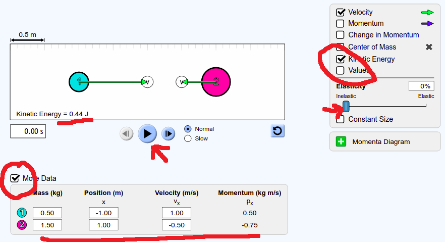
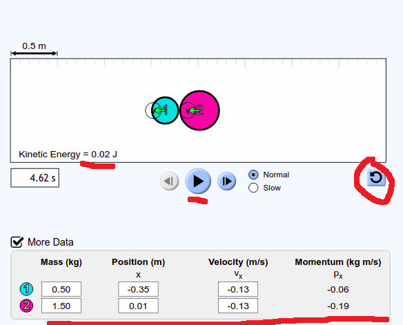
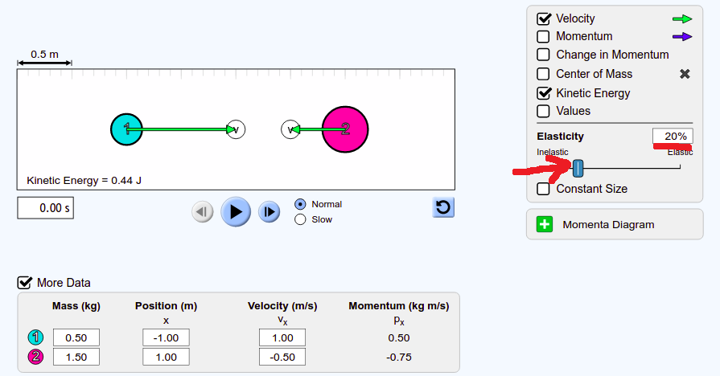

<style>
body {
  font-family: cursive;
  line-height: 1.4;
  font-weight: normal;
  font-stretch: normal;
  font-size: 20px;
  color: darkblue;
}

a:link {
  color: #8B1A1A;
}

</style>

```{r setup, include=FALSE}
knitr::opts_chunk$set(echo = FALSE, warning = F, message = F)
```


```{r libraries}
library(tidyverse)
library(ggpubr)
library(wesanderson)
library(gt)
library(ggtext)
library(latex2exp)
library(scales)

# options(scipen = 100)
```


## Theory
This week we're going to do a lab based on the **conservation of momentum** and **coefficient of resititution**. We're going to let objects collide, see how their momenta change, and examine the effects of elastic collisions. There won't be any graphs this week, but there will be quite a few tables.

## Set-Up and Results

Go to the collisions experiment on the [PHET website](https://phet.colorado.edu/sims/html/collision-lab/latest/collision-lab_en.html). Go to the **Intro** tag here.

1.  Check the box **Kinetic Energy** on the right and the box **More Data** on the left. Adjust the **Elasticity** slider to read 0%.  
Record the _Kinetic Energy_ (0.44J here) and all the values in the _More Data_ box (the _Mass_, _Position_, _Velocity_, and _Momentum_).  
Press **Play**.

  

<br>
<br>
2. Once the collision has ocurred, press the **Pause** button. Record the new values for the _Kinetic Energy_ and the values in the _More Data_ box. When you have done this, refresh the demo by pressing the blue button to the bottom right of the collision screen.  

  

<br>
<br>

3. Readjust the **Elasticity** slider to 20%. Repeat the measurements from steps 1 and 2 above. Do this again for **Elasticity** set to 40%, 60%, 80%, and 100%.



<br>
<br>

## Data  

Fill out a series of tables, one for each setting of **Elasticity**. For the values seen above, this is shown here:

```{r data}
z <- tibble(rowname = c("mass_1", "mass_2", "Total"),
            mass = c(0.5, 1.5, NA),
            vel_int = c(1, -0.5, 1.5),
            p_int = c(0.5, -0.75, -0.25),
            KE_int = c(0.25, 0.19, 0.44),
            vel_f = c(-0.13, -0.13, 0),
            p_f = c(-0.06, -0.19, -0.25),
            KE_f = c(0.004, 0.013, 0.02))
```

```{r table}
z %>% 
  gt() %>% 
  tab_header(title = "Results for Elasticity = 0%") %>% 
  tab_footnote(footnote = md("Calculated by the difference between the velocity of mass<sub>1</sub> and mass<sub>2</sub>"),
               locations = cells_body(
                 columns = vars(vel_int, vel_f),
                 rows = 3)) %>% 
  tab_footnote(footnote = md("Calculated using <span>&#189;</span>mv<sup>2</sup>"),
               locations = cells_body(
                 columns = vars(KE_int, KE_f),
                 rows = 1:2)) %>% 
  cols_label(rowname = "",
             mass = md("**Mass (kg)**"),
             vel_int = md("**V<sub>0</sub> (m/s)**"),
             p_int = md("<i style = 'font-size:15px;' >**Momentum<sub>0</sub> (kg m/s)**</i>"),
             KE_int = md("**KE<sub>0</sub> (J)**"),
             vel_f = md("**V<sub>final</sub> (m/s)**"),
             p_f = md("<i style = 'font-size:15px;' >**Momentum<sub>final</sub> (kg m/s)**</i>"),
             KE_f = md("**KE<sub>final</sub> (J)**")) %>%   
  cols_align(align = "center") %>%
  tab_options(column_labels.background.color = "cornflowerblue", 
              table.font.names = "Caveat",
              table.font.style = "oblique",
              column_labels.font.weight = "bold",
              column_labels.vlines.width = 1,
              column_labels.vlines.color = "darkblue",
              column_labels.vlines.style = "solid",
              table_body.vlines.width = 1,
              table_body.vlines.color = "darkblue",
              table_body.vlines.style = "solid"
  ) %>% 
  tab_style(
    style = list(cell_fill(color = "#eeeeee")),
    locations = cells_body(columns = seq(1, 7, by=2))
  ) %>% 
  cols_width( ~ px(110)) %>% 
  tab_options(table.font.size = 24)
```

<br>
<br>

## Analysis

For each table, calculate the **Coefficient of Restitution** by dividing the velocity of separation after the collision by the velocity of approach before the collision. For the table above, this is done by:

$$COR\:=\: \frac{velocity\;of\;separation}{velocity\;of\;approach}\:=\: \frac{0}{1.5}\:=\: 0.0$$
<br>
Calculate the amount of kinetic energy lost in the collision by subtracting the $KE_{final}$ from $KE_0$. For the table above this would be:

$$Kinetic\:Energy\:Lost\:=\:KE_0\:-\:KE_{final}\:=\:0.44\:-\:0.02\:=\:0.42\:J$$
<br>
<br>

## Discussion 

Make a table of your results, filling it out as below:  
<br>
```{r discussion}
disc <- tibble(elastic = seq(0, 100, by = 20),
               COR = rep("", 6),
               KE_lost = rep("", 6))
disc$COR[1] <- 0.0
disc$KE_lost[1] <- 0.42


disc %>% 
  gt() %>% 
  tab_header(title = "Overall Results") %>% 
  cols_label(elastic = md("**Elasticity (%)**"),
             COR = md("**Coeff. of Restitution**"),
             KE_lost = md("**Kinetic Energy Lost (J)**")) %>% 
  cols_align(align = "center") %>%
  tab_options(column_labels.background.color = "cornflowerblue",
              table.font.names = "Caveat",
              table.font.style = "oblique",
              column_labels.font.weight = "bold",
              column_labels.vlines.width = 1,
              column_labels.vlines.color = "darkblue",
              column_labels.vlines.style = "solid",
              table_body.vlines.width = 1,
              table_body.vlines.color = "darkblue",
              table_body.vlines.style = "solid"
  ) %>%
  tab_style(
    style = list(cell_fill(color = "#eeeeee")),
    locations = cells_body(rows = seq(2, 6, by=2))
  ) %>%
  cols_width( ~ px(200)) %>%
  tab_options(table.font.size = 24)

```

<br>
For this lab, we can't really discuss inaccuracies, but your discussion section should include a discussion of how our results relate to **momentum conservation** and **energy loss in inelastic collisions**.
<br>
<br>
