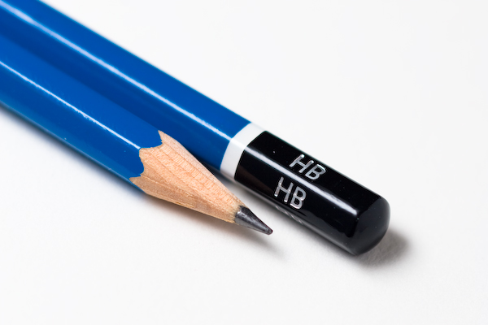

<!-- background-image: url(img/xkcd.png) -->

```{r setup, include=FALSE}
options(htmltools.dir.version = FALSE)
```

```{r xaringan-extra, echo=FALSE}
library(xaringanExtra)
xaringanExtra::use_panelset()
```

???

Image credit: [Wikimedia Commons](https://commons.wikimedia.org/wiki/File:Sharingan_triple.svg)

---
class: center, middle

# Graphs

## ... and how they should be drawn

---
class: inverse

.panelset[

.panel[
.panel-name[Rules]


1. Use Pencil  

2. All graphs have titles  

3. Label the axes  

4. Choose scales for the axes  

5. Draw in points  

6. Best fit line  

7. Calculate slope  

]

.panel[
.panel-name[1]
.pull-left[

]
.pull-right[

]

- don't use pen anywhere on the graph page
- this means pencil for:
    - graph title
    - axes titles
    - everything
- even in the margins around the edge of the page - Pencil
] <!-- end of panel -->

.panel[
.panel-name[2]
.pull-left[
### Template for Title
- format
    - what's on _y axis_
    - _vs_
    - what's on _x axis_
    - and some _context_

- Don't use abbreviations 
- Graph title not the same as the experiment title 
- Don't be afraid to be expansive, give details in the *context* part
]

.pull-right[

]
] <!-- end of panel -->

.panel[
.panel-name[3]
.pull-left[
### Axes Labels
- can use abbreviations
- always give units
]

.pull-right[

]

] <!-- end of panel -->

.panel[
.panel-name[labels]
<br>
<br>


] <!-- end of panel -->

.panel[
.panel-name[4]
.pull-left[
### Axes Scales
- look at range of data
- count number of available boxes on axes
- always use multiples of 1, 2, 5...
- or 0.5, 0.2, 0.1...
- can go landscape if better
]

.pull-right[

]

] <!-- end of panel -->

.panel[
.panel-name[5]
.pull-left[
### Put in the points
- using their x and y coordinates
- dot where actual measurements land
- circle around point indicating level of uncertainty
- don't make circles too small
]

.pull-right[
 
]

] <!-- end of panel -->

.panel[
.panel-name[6]
.pull-left[
### Best Fit Line
- draw a line nested through the points
- one straight line in midst of points
- usually close to the origin, but never through it
- usually roughly equal number of points above and below
- don't just connect first and last points
]

.pull-right[
  
]
]<!-- end of panel -->

.panel[
.panel-name[7]
.pull-left[
### Calculate Slope
- pick two points at either extreme of line
    - not data points
- work out the (x, y) coordinates for each point
- use formula $slope\:=\:\frac{y_2-y_1}{x_2-x_1}$
- do calculation on graph page if you have space
]

.pull-right[
  
]
]<!-- end of panel -->

.panel[
.panel-name[8]

]

] <!-- end of panelset -->
