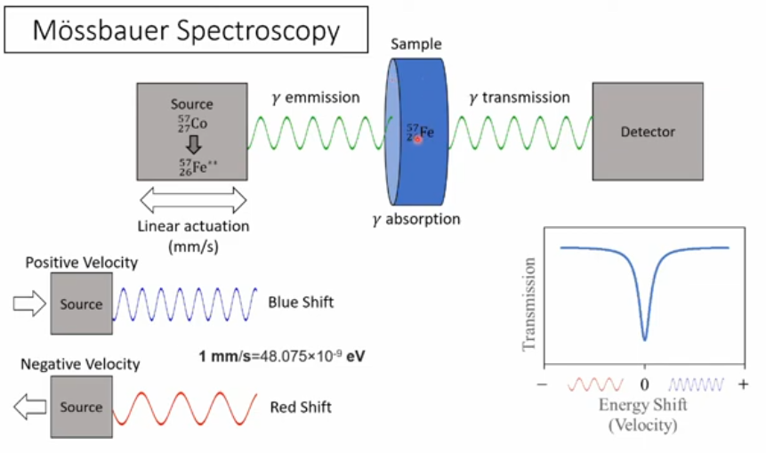
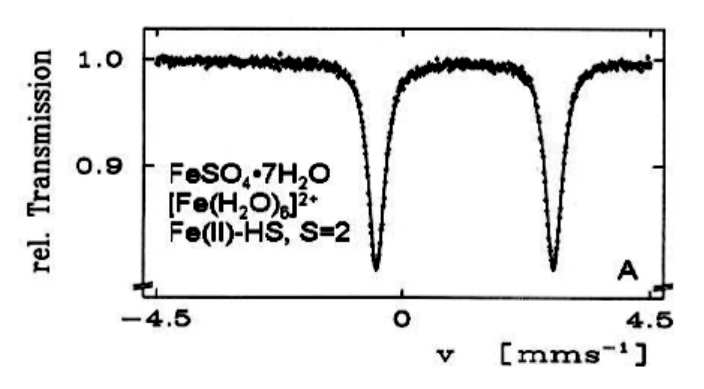

## Summary

Nuclear radiation can be very useful. We've already mentioned its use in medical diagnostics and therapy, and in the production of nuclear energy. In this section we'll discuss further applications such as *radiocarbon dating*, *radiometric dating of rocks*, chemical environment analysis by the *Mössbauer effect*, and *nuclear spins*.

## Contents

1.  Radioactive Decay Laws

    -   half lives and activities

2.  Radioactive Dating

    -   radiocarbon dating of biological samples

    -   dating rocks

3.  Mössbauer Spectroscopy

4.  Nuclear Spins

5.  Diagnostic Nuclear Medicine

6.  Therapeutic Nuclear Medicine

## Radioactive Decay Laws

-   decay of individual nucleus is a totally random process, occurs with certain probability in a certain time period
-   for large numbers of nuclei can use statistics
-   rate of disintegrations from a nuclear source is proportional to the number of radioactive nuclei present

## 

:::: callout-tip
## Mathematics of Radioactive exponential decay

::: {style="font-size: 150%;"}
-   $-\frac{dN}{dt}\;\alpha\;N$
-   $-\frac{dN}{dt}\;=\;\lambda\;N$
-   $N\;=\;N_0e^{-\lambda t}$
:::
::::

-   where N is the number of radioactive nuclei present at a particular time
-   $-\frac{dN}{dt}$ is the rate of decrease in N.
-   $N_o$ is the original number of nuclei present.
-   $\lambda$ is called the radioactive decay constant and depends on the nature of the nucleus

## Radioactive Half Life, $T_{1/2}$

<br>

-   a convenient way of discribing radioactive decay is in terms of the radioactive half life, $T_{1/2}$ .
-   the half life is defined as the time taken for the number of radioactive nuclei present in a source to fall to half it’s original value.
-   half lives of naturally occurring radioisotopes vary over a wide range
    -   $3 \times 10^{-7}$s ($^{212}Po$) to $1.4 \times 10^{10}$years ($^{232}Th$)

## 

<br> <br> <br>

:::: callout-tip
## the half life is related to the decay constant by:

::: {style="font-size: 200%;"}
-   $T_{1/2}\;=\;\frac{log_e2}{\lambda}\;=\;\frac{0.693}{\lambda}$
:::
::::

## Radioactive Decay Curve

```{r decay_curve}
#| echo: false
#| message: false
#| warning: false

library(tidyverse)
library(ggrepel)
library(showtext)
library(ggtext)
library(envalysis)

font_add(family = "Ink Free", regular = "assets/Inkfree.ttf")
showtext_auto()

time0 <- seq(0, 5, by = 0.001)
n0 <- 100*exp(-time0*log(2))


z <- tibble(half_lives = time0, number = n0)

x_lines <- tibble(x = 0, xend = 1:4, y = 100/c(2, 4, 8, 16), 
                  colour = c("#570700", "#bb2517", "#f25c4e", "#ffbcb4"))
y_lines <- tibble(x = 1:4, y = 0, yend = 100/c(2, 4, 8, 16), 
                  colour = c("#570700", "#bb2517", "#f25c4e", "#ffbcb4"))

z |> ggplot(aes(half_lives, number)) +
  geom_line(size = 2, colour = "firebrick4") +
  labs(title = "Radioactive Decay Curve",
       x = "Number of Half-Lives (t<sub>1/2</sub>)",
       y = "Percentage of Number of Initial Nuclei Left") +
  geom_segment(data = x_lines, aes(x = x, xend = xend, y = y, yend = y, colour = colour), 
               linetype = 2) +
  geom_segment(data = y_lines, aes(x = x, xend = x, y = y, yend = yend, colour = colour), 
               linetype = 2) +
  scale_color_identity() + 
  coord_cartesian(expand = FALSE) +
  theme_publish(base_size = 32, base_family = "Ink Free", base_linewidth = 0.7) +
  theme(axis.title = element_markdown())
```

## Measurement of Radiation

### Activity

-   This is the number of disintegrations occurring per second.
-   It is easily measured with a Geiger counter.
-   This activity is proportional to the number of radioactive atoms in the sample.\
-   $Activity\;=\; -\frac{dN}{dt}\; =\;\lambda N$
-   for radioactive dating, for a source activity A we get $A \; = \;A_0e^{-\lambda t}$
    -   so $t \; = \frac{-1}{\lambda} \; ln(\frac{A}{A_0})$

## 

### The units of activity are:

-   Curie (Ci)
    -   $1\;Ci\; =\; 3.7 \times10^{10}\; disintegrations/sec$
    -   A clinical source of $^{60}Co$ has an activity of several Ci
    -   An internally administered dose for cancer treatment would have an activity of $10^{-3}$ Ci
-   Becquerel (Bq)
    -   1 Bq = 1.0 disintegrations /sec
    -   This is the SI. unit (1 Ci = $3.7 \times 10^{10}$ Bq)

## Radioactive Dating

-   we'll look at this in two regimes

    -   radiocarbon dating using $^{14}C$ for historic, biological samples

    -   dating of rocks using $^{235}U$ / $^{207}Pb$ and $^{238}U$ / $^{206}Pb$

## Radiocarbon Dating - $^{14}C$

-   natural carbon has two isotopes ($^{12}C$ and $^{13}C$)

-   $^{14}C$ produced in the upper atmosphere ($^{14}N \; + \; ^1n \; \longrightarrow \; ^{14}C \; + \; ^1p$)

    -   those neutrons are produced by cosmic rays (mostly highly energy protons) striking other nuclei)

-   $^{14}C$ has a half-life of 5730 years and $\beta^-$ decays to $^{14}N$ (158keV)

    -   1g of (*fresh*) carbon produces about 15 decays per minute (0.255 Bq)

## 

::: {.callout-tip collapse="false"}
## Radiocarbon dating

-   an archeological sample of 250mg of carbon exhibits a radioactivity of 5.1 mBq from $^{14}C$. Calculate the age of the sample.

    -   first calculate $\lambda$ from the half life

        -   $\lambda \; = \; \frac{log_e(2)}{T_{1/2}} \;= \; \frac{0.693}{5730} \; = \; 121 \times 10^{-6} yr^{-1}$

    -   at time zero, 1g of carbon produces 0.255 Bq

    -   our sample of 250mg produces 5.1 mBq

        -   so if our sample was 1g we'd get $5.1 \; mBq \times \; \frac{1000}{250} \; = \; 20.4 \; mBq \; = \; 0.0204 Bq$

    -   radioactivity (and thus total amount of $^{14}C$) has decreases by $\frac{0.0204}{0.255} \; = \; 0.08$

    -   age of sample given by $t \; = \; \frac{log_e(0.08)}{-\lambda} \; = \; \frac{-2.5257}{121 \times 10^{-6}} \; = \; 20,873 \; years$
:::

## 

::: {.callout-tip collapse="false"}
## Amount of $^{14}C$ in Carbon

-   given that natural carbon has a radioactivity of 0.255 Bq per gram from $^{14}C$, calculate what fraction of carbon atoms are $^{14}C$.

    -   first calculate $\lambda$ from the half life, but this time in seconds

        -   $\lambda \; = \; \frac{log_e(2)}{T_{1/2}} \;= \; \frac{0.693}{5730 \times 365.25 \times 24 \times 3600} \; = \; 3.833 \times 10^{-12} s^{-1}$

    -   then calculate the number of $^{14}C$ atoms, N, in one gram from the activity:

        -   $-\frac{dN(t)}{dt} \; = \; \lambda \; \times \; N \; = 0.255 s^{-1}$

        -   $N \; = \; \frac{0.255}{3.833 \times 10^{-12}} \; = \; 66.52 \times 10^{9} \; atoms/gram$

    -   then calculate the total of carbon atoms in one gram

        -   $\frac{1}{12.011} \; \times \; 6.022 \times 10^{23} \; = \; 5.0137 \times 10^{22} \; atoms/gram$

    -   take the ratio of the two to get

        -   fraction of $^{14}C$ atoms to be $\frac{66.52 \times 10^{9}}{5.0137 \times 10^{22}} \; = \; 1.33 \times 10^{-12}$
:::

## 

### Limitations of $^{14}C$ dating

::: {style="font-size: 80%;"}
-   assumes atmospheric content of $^{14}C$ has been stable over time (50,000 years)

    -   flux of cosmic rays adjusted by strength of Earth's magnetic dipole moment

        -   e.g. magnetic dipole minimum 40,000 years ago lead to doubling of atmospheric $^{14}C$

    -   geomagnetic latitudinal variation

        -   more cosmic rays at high latitudes, but atmosphere pretty well mixed

    -   in recent times, burning fossil fuels has diluted $^{14}C$ levels whereas nuclear weapons testing in the 1950's has boosted the amount because of the number of neutrons emitted from atomic bombs

-   time limitations

    -   after \~50,000 years there won't be much $^{14}C$ left

    -   measure $^{14}C$ directly using mass spectrometry rather than measuring radiation
:::

## Dating of Rocks using U / Pb Ratios

-   both $^{238}U$ and $^{235}U$ are radioactive and eventually decay to $^{206}Pb$ and $^{207}Pb$ respectively by emitted $\alpha$ particles

-   their half-lives are convenient for geology; $^{235}U$ is 0.7 billion years and $^{238}U$ is 4.5 billion years

-   Zircon $ZrSiO_4$ is an extremely stable and long-lived mineral

    -   zirconium is chemically compatible with uranium but not at all with lead

        -   when formed $ZrSiO_4$ will contain lots of uranium in place of Zr, but no Pb

    -   get $t \; = \frac{T_{1/2}}{0.693} \; log_e(\frac{1}{R} + 1)$ where $t$ is the age of the rock and $R$ is the ratio of uranium to lead

## 

::: {.callout-tip collapse="false"}
## Age of Rocks from Peru

-   a zircon grain from a rock from Peru has a ratio of $^{235}U$/$^{207}Pb$ of 0.0833 and a ratio of $^{238}U$/$^{206}Pb$ of 2.51. Use both ratios to calculate two ages for this zircon grain. Are the figures compatible?

    -   for $^{235}U$/$^{207}Pb$

        -   $t \; = \; \frac{T_{1/2}}{0.693} \; log_e(\frac{1}{R} + 1)$

        -   $t \; = \; \frac{0.7 \times 10^9}{0.693} \; log_e(\frac{1}{0.0833} + 1) \; = \; 2.59 \; billion \; years$

    -   for $^{238}U$/$^{206}Pb$

        -   $t \; = \; \frac{4.5 \times 10^9}{0.693} \; log_e(\frac{1}{2.51} + 1) \; = \; 2.18 \; billion \; years$

-   these values don't agree (called discordant).

-   The zircon grain must have been damaged/altered sometime since its formation
:::

## Mössbauer Spectroscopy

::: {style="font-size: 75%;"}
-   as well as emitting $\gamma$ rays, nuclei can also absorb them

    -   but have to be just the right energy

    -   in practise this means coming from the same nucleus

    -   problem then is the recoil of the nucleus on both emission and absorbtion

        -   this soaks up some of the energy from the $\gamma$ ray

        -   get recoil energy $= \; E_R \; = \; \frac{E_{\gamma}^2}{2Mc^2}$ where M is the mass of the nucleus

        -   e.g. 129.43 keV $\gamma$ from $^{191}Ir$ has recoil loss of $E_R \; = \; \frac{E_{\gamma}^2}{2Mc^2} \; = \; \frac{(129.43 \times 10^3 \; \times \; 1.602 \times 10^{-19})^2}{2 \; \times \; 190.96 \; \times \; 1.6605 \times 10^{-27} \; \times \; (3 \times 10^8)^2} \; = \; 0.0453 eV$

        -   this doesn't sound like much, but is way bigger than the natural linewidth of the transition $\Delta E \; = \; \frac{\hbar}{T_{1/2}} \; = \; 1.34 \times 10^{-16} eV$ for the 4.9s half life of $^{191}Ir$

        -   and also, have to double $E_R$ as effect both absorbtion and emission
:::

## 

### Mössbauer Spectroscopy (continued)

-   answer is to insert radioactive nuclei into a rigid solid

-   then recoil is from solid as a whole rather than indiviual nuclei

-   not hard to compensate for this difference using Doppler Effect

    -   $v \; = \; c \frac{2 \times E_R}{E_{\gamma}}$

    -   leads to velocities of \~1 mm/sec

        -   as opposed to \~ 100 m/sec for free ions

-   gives exquisite precision (1 part in $10^{13}$)

## 

### Applications of Mössbauer Effect

-   key tool for studying chemical environments of relevant ions:

    -   $^{57}Fe$, $^{119}Sn$, $^{121}Sb$, $^{151}Eu$

-   beautiful demonstration of General Relativity

    -   red-shift of photons as they climb through Earth's gravitational field

## 



## 



## Nuclear Spins and Magnetic Moments

::: {style="font-size: 85%;"}
-   charged particles behave like little magnets because of both:

    -   their orbital motion, for example electrons in an atom

    -   but they also appear to have an *intrinsic* motion, their spin

-   for the electron, this latter leads to a magnetic moment given by:

    -   $\mu_e \; = \; g \frac{e \hbar}{2m_e} \; = g \; \mu_B$

    -   where $\mu_B \; = \; 9.2741 \times 10^{-24} J/T$ is the Bohr Magneton

-   for nucleons things are a little more complicated

    -   analogous nuclear moment is expressed in terms of the nuclear magneton ($\mu_N$)

    -   $\mu_N \; = \; \frac{e \hbar}{2m_p} \; = \; 5.0508 \times 10^{-27} J/T$

        -   $\mu_p \; = \; 2.793 \; \mu_N$

        -   $\mu_n \; = \; -1.913 \; \mu_N$
:::

## 

### Magnetic Moments of Nuclei

-   in a nucleus, in the ground state paired nucleons will cancel out their magnetic moments

    -   even / even nuclei has zero magnetic moment (in their ground state)

    -   overall magnetic moment given by the values from the final, unpaired proton and/or unpaired neutron

## 

```{r mag_moments}
#| echo: false
#| message: false
#| warning: false

library(tidyverse)
library(gt)

my_file <- here::here("lectures", "physics-nuclear", "background", "nuclear-moments-table.csv")
z <- read_csv(my_file)
z |> 
  filter(ex == 0) |> 
  slice_sample(n=10) |> 
  arrange(z) |> 
  select(-z, -ex) |> 
  #mutate(m_nm = m_nm |> as.numeric() |> signif(4)) |> 
  gt() |> 
  fmt_markdown(columns = latex) |> 
  cols_label(latex = "Nucleus",
             # ex = "Ground State",
             t1_2 = "Half Life",
             i = "Spin State",
             m_nm = html("Magnetic Moment (μ<sub>N</sub>)")
             ) |> 
  opt_table_font(font = google_font("Kalam"), size = 28) |> 
  cols_align(align = "right", columns = m_nm)|> 
  cols_align(align = "center", columns = i)

```

## Nuclear Medicine

- diagnostics

- therapeutics

- we'll look at a selection of modalities for diagnostics

    - MRI
    
    - fMRI
    
    - PET
    
    - SPECT
    
##

### Magnetic Resonance Imaging

::: {style="font-size: 85%;"}

- nuclei with magnetic spins will tend to line up in a magnetic field (~1.5T)

    - will have different energies for spin up versus spin down
    
    - if we give them just the right energy they can flip-flop between spin up or down
    
    - can detect these flips and see where the nuclei are
    
    - have gradient applied magnetic field and apply radio frequency at right frequency to do the flips
    
    - reconstruct tomographically
    
    - very good for soft tissue (most MRI tunes to $^1H$)
    
    - two types
    
        - T1 tunes to fat, shows anatomy
        
        - T2 tunes to water, shows pathology
        
    - MRI images take several minutes, can't have body movement
    
        - can do coronary studies by ECG gating
    
:::
    
##

### fMRI

- carry out sequence of MRI scans while patient is asked to perform tasks

- differences in MRI scans between times when tasks are performed can indicate which (brain) areas are involved 

##

### PET (positron emission tomography)

- introduce radioactive element in to body

- it emits a positron

- this annihilates with an electron

- emits 2 $\gamma$ rays of 511keV in exactly opposite directions

- when these are detected, can figure out line along which original radioactive element was

- usually use FDG molecule, glucose-like

    - laced with $^{18}F$ instead of an $OH^-$ group
    
    - $^{18}F$ is a positron emittter, $T_{1/2}$ = 110 minutes
  
    - anomalous build-up of this _glucose_ means cells with higher metabolism, maybe cancer
    
##

### SPECT (Single Photon Emission Computed Tomography)

- label pharmachemical with $\gamma$ emitter

    - often $^{99}Tc$


##

### Gamma Camera

- used to detect $\gamma$ rays from PET or SPECT

- consists of:

    - outer tubes of lead to only permit passage of $\gamma$rays perpendicular to camera surface
    
    - scintillation crystal (NaI) that will emit optical flash when $\gamma$ ray strikes
    
    - camera to detect thesee flashes
    
- looks a lot like the tube of a CT or MRI machine

## Nuclear Radiotherapy


## Equations

::: {style="font-size: 80%;"}
-   $N\;=\;N_0e^{-\lambda t}$

-   $t_{1/2}\;=\;\frac{log_e2}{\lambda}\;=\;\frac{0.693}{\lambda}$

-   $Bq = Ci \times 3.7\times10^{10}$

-   $(energy\;in\;joules) = MeV \times 1.6\times 10^{-13}$

-   $Gray = \frac{Bq \times (energy\;in\;joules)}{(person\;mass\; in \;kg)}$

-   $Sv = \frac{Bq \times (energy\;in\;joules) \times RBE }{(person\;mass\; in \;kg)}$

-   $(expected\;number\; of\; deaths) = \frac{(dose\; in\; Sievert) \times (population)}{50}$

-   typical daily dose = 10$\mu$Sv.

-   $LD_{50 / 30}$ = 4Sv
:::

## References

-   [Young & Freedman - chapter 43.3-43.5](https://ebookcentral.proquest.com/lib/tudublin/reader.action?docID=5853694&ppg=1482){target="_blank"}
-   [Serway & Jewett - chapter 43.4](https://viewer.ebscohost.com/EbscoViewerService/ebook?an=2639146&callbackUrl=https%3a%2f%2fresearch.ebsco.com&db=nlebk&format=EB&profId=ehost&lpid=&ppid=&lang=en&location=https%3a%2f%2fresearch.ebsco.com%2fc%2fsr37fs%2fsearch%2fdetails%2flh37eixz3f%3fdb%3dnlebk%26db%3dnlabk&isPLink=False&requestContext=&profileIdentifier=sr37fs&recordId=lh37eixz3f){target="_blank"}

-   [Nuclear Chart](https://atom.kaeri.re.kr/nuchart/){target="_blank"}

-   [Nuclear Chart](https://atom.kaeri.re.kr/nuchart/){target="_blank"}

-   [Nuclear Chart](https://atom.kaeri.re.kr/nuchart/){target="_blank"}

-   [MRI](https://www.radiologymasterclass.co.uk/tutorials/mri/mri_scan){target="_blank"}

-   [Young & Freedman - MRI](https://ebookcentral.proquest.com/lib/tudublin/reader.action?docID=5853694&ppg=1476){target="_blank"}

-   [fMRI on Coursera](https://www.coursera.org/learn/functional-mri/home/module/2){target="_blank"}
