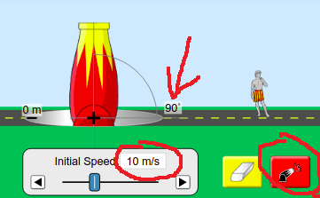
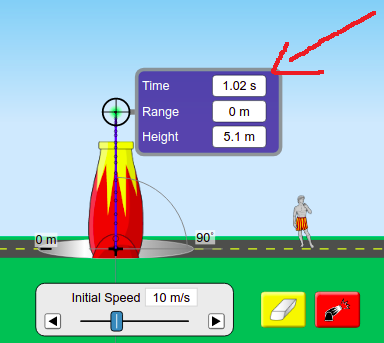
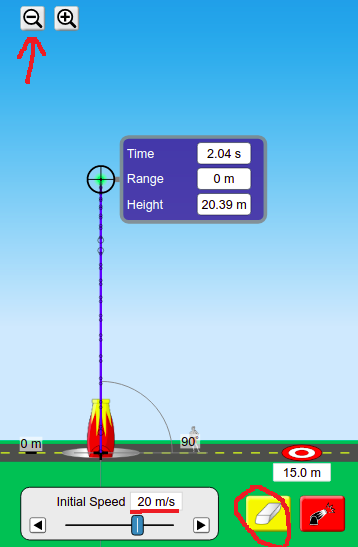

<style>
body {
  font-family: cursive;
  line-height: 1.4;
  font-weight: normal;
  font-stretch: normal;
  font-size: 20px;
  color: darkblue;
}

a:link {
  color: #8B1A1A;
}

</style>

```{r setup, include=FALSE}
knitr::opts_chunk$set(echo = FALSE, warning = F, message = F)
```

## Theory
This week we're going to do a lab based on the kinematic equations. We're going to fire projectiles straight up and measure how far they rise, and what time they take to get to the top. We're then going to plot two separate relationships, each one will give us a value for the acceleration due to gravity. We can then compare that to the text book value.

## Set-Up and Results

Go to the projectile motion experiment on the [PHET website](https://phet.colorado.edu/sims/html/projectile-motion/latest/projectile-motion_en.html). Go to the _Lab_ tag here.

1. Orient the cannon to be vertical (set the angle to $90^{\circ}$), set the **initial velocity** to be 10 m/s. and fire the cannon. 
<br>  

<br>  
<br>
2. Drag the measurement box down from the utilities section in the top right corner, and place the cross-hairs exactly over the very top part of the cannonball's flight. Record the **Time** and **Height**.   
<br>  

<br>  
<br>  
3. Erase the cannonball track with the yellow eraser. Reset the **Initial Speed** to 12 m/s and fire the cannon ball again. Again, record the **Time** and **Height**. Keep doing this. For higher speeds, you'll need to adjust the scale magnifiers (as shown below for 20 m/s).
<br>  

<br>  
<br>  
4. Fill out the table below.
<br>  
<br>  
<br>  

## Table
  
Fill out a table as shown below. A handful of my measurements have been included just to give you an idea of the kind of figures to expect, you should replace these values with your own which are more accurate.  
<br> 
<br>  

```{r libraries}
library(tidyverse)
library(ggpubr)
library(wesanderson)
library(gt)
library(ggtext)
library(latex2exp)
library(scales)

# options(scipen = 100)
```

```{r data}
z <- tibble(v0 = seq(10, 30, by=2),
            v0_squared = v0^2,
            time = c(1.02, 1.22, 1.43, 1.63, 1.83, 2.04,
                     2.24, 2.45, 2.65, 2.85, 3.06),
            time_empty = rep("", 11), 
            height = c(5.10, 7.34, 9.99, 13.05, 16.51, 20.39,
                       24.67, 29.36, 34.45, 39.96, 45.87),
            height_empty = rep("", 11)) 

z$time_empty[1] <- z$time[1]
z$height_empty[1] <- z$height[1]
z$time_empty[4] <- z$time[4]
z$height_empty[7] <- z$height[7]
```

```{r table}
z %>% 
  select(-c(time, height)) %>% 
  gt() %>% 
  cols_label(v0 = md("**v<sub>0</sub>(m/s)**"),
             v0_squared = md("**v<sub>0</sub><sup>2</sup>(m<sup>2</sup>/s<sup>2</sup>)**"),
             height_empty = md("**h(m)**"),
             time_empty = md("**t(s)**")) %>% 
  cols_align(align = "center") %>%   
  tab_options(column_labels.background.color = "cornflowerblue", 
              table.font.names = "Caveat",
              table.font.style = "oblique",
              column_labels.font.weight = "bold",
              column_labels.vlines.width = 1,
              column_labels.vlines.color = "darkblue",
              column_labels.vlines.style = "solid",
              table_body.vlines.width = 1,
              table_body.vlines.color = "darkblue",
              table_body.vlines.style = "solid"
  ) %>% 
  tab_style(
    style = list(
      cell_fill(color = "#eeeeee")
    ),
    locations = cells_body(rows = seq(2, 10, by=2))
  ) %>% 
  cols_width( ~ px(150)) %>% 
  tab_options(table.font.size = 24)
```
<br>
<br>

## Graph  
Plot a graph of initial velocity ($v_0$) versus time. Calculate the slope of this line. It should look a little like the graph sketched below.

```{r graph1, fig.width=6, fig.align = 'center'}
z %>% ggplot(aes(time, v0)) + 
  geom_point(size = 5, show.legend = F, shape = 1) + 
  geom_point(show.legend = F) + 
  geom_smooth(method = "lm", fullrange = T, se = F, show.legend = F) + 
  labs(title = "Initial Velocity vs Time for Projectile\nMotion with No Air Resistance",
       x = "Time (s)",
       y = TeX("$v_0 (m/s)$")) + 
#  scale_x_continuous(labels = label_number_si(accuracy = 0.00001)) + 
  #  scale_y_continuous(labels = scientific) + 
  stat_regline_equation(formula = y ~ x - 1,
                        output.type = "latex",
                        show.legend = F,
                        size = 8,
                        family = "Ink Free",
                        col = "firebrick4") +
  theme_minimal() + 
  theme(text = element_text(family = "Ink Free", size = 18),
        plot.title = element_text(size = 24))
```

Plot a graph of initial velocity squared ($v_0^2$) versus height. Calculate the slope of this line. It should look a little like the graph sketched below.

```{r graph2, fig.width=6, fig.align = 'center'}
z %>% ggplot(aes(height, v0_squared)) + 
  geom_point(size = 5, show.legend = F, shape = 1) + 
  geom_point(show.legend = F) + 
  geom_smooth(method = "lm", fullrange = T, se = F, show.legend = F) + 
  labs(title = "Initial Velocity Squared vs Height for Projectile\nMotion with No Air Resistance",
       x = "Height (m)",
       y = TeX("$v_0^2 (m/s)$")) + 
  #  scale_x_continuous(labels = label_number_si(accuracy = 0.00001)) + 
  #  scale_y_continuous(labels = scientific) + 
  stat_regline_equation(formula = y ~ x - 1,
                        output.type = "latex",
                        show.legend = F,
                        size = 8,
                        family = "Ink Free",
                        col = "firebrick4") +
  theme_minimal() + 
  theme(text = element_text(family = "Ink Free", size = 18),
        plot.title = element_text(size = 24))

```


## Analysis

The slope of the first graph will be equal to $g$ (using $v\:=\:v_0\:+\:at$ and taking into account the opposite directions of $v_0$ and g).  
So the slope of the first graph will be a measurement of _g_.

The slope of the second graph will be equal to $2\times g$ (using $v^2\:=\:v_0^2\:+\:2 \times a \times s$ and again taking into account the opposite directions of $v_0$ and g).  
So the _g_ will be equal to the slope of the second graph divided by _2_.


## Discussion

The reference value for $g$ is $9.81 m/s^2$.
