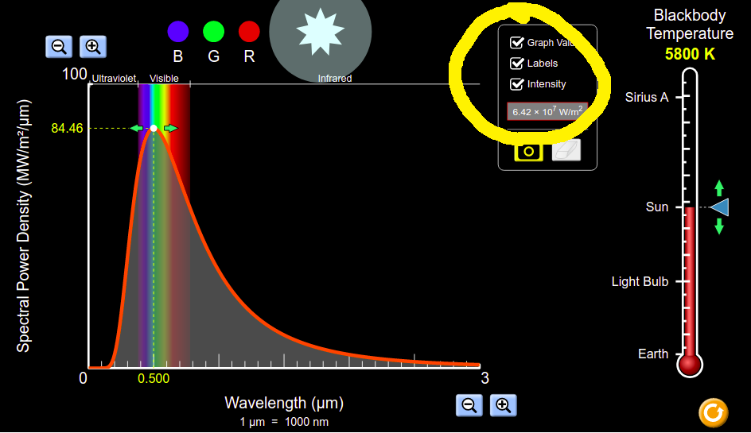
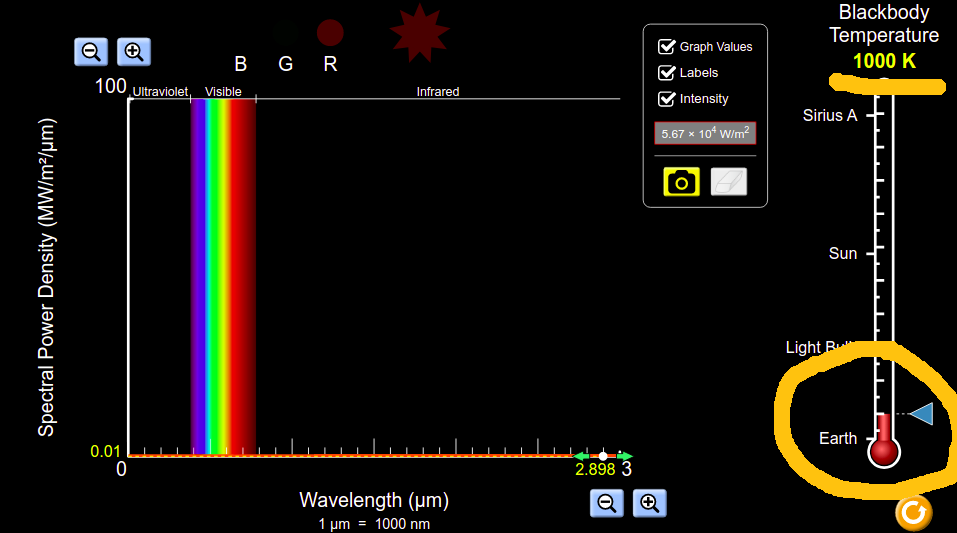
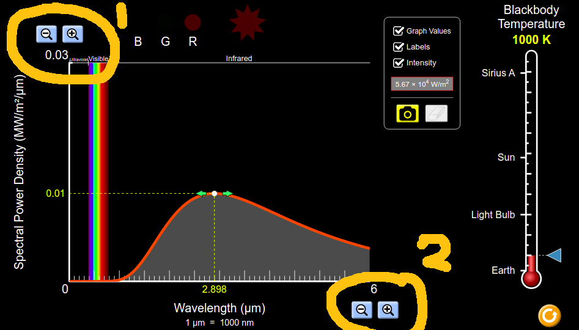
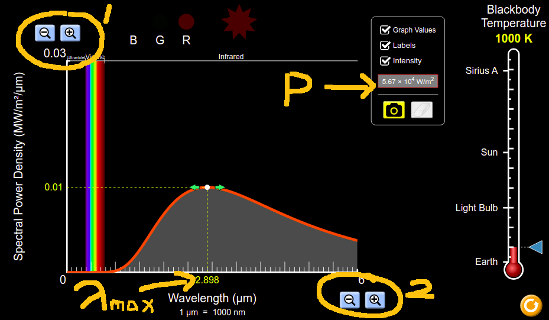

<style>
body {
  font-family: cursive;
  line-height: 1.4;
  font-weight: normal;
  font-stretch: normal;
  font-size: 20px;
  color: darkblue;
}

a:link {
  color: #8B1A1A;
}

</style>

```{r setup, include=FALSE}
knitr::opts_chunk$set(echo = FALSE, warning = F, message = F)
```

## Theory
There are two goals to this experiment, involving two graphs and two calculations. We'll finish with values for two physical constants of nature; [Wien's Displacement Constant](https://en.wikipedia.org/wiki/Wien%27s_displacement_law) and [Stefan's Constant](https://en.wikipedia.org/wiki/Stefan%E2%80%93Boltzmann_constant).  
1. This experiment sets out to prove the Wien's Displacement Law, $\lambda_{max}\:=\:\frac{b}{T}$ where $\lambda_{max}$ indicates the colour emitted by an object by thermal radiation, $T$ is the temperature in Kelvin, and $b$ is a constant. The experiment will provide a value for this constant, $b$.  
2. This experiment then sets out to prove the Stefan's Law, $P\:=\:\sigma\epsilon A T^4$ where $A$ is the area of the surface that is emitting light, $\epsilon$ is how matt or shiny it is (we'll assume $\epsilon\:=\:1$ here), $T$ is the temperature in Kelvin, and $\sigma$ is a constant. The experiment will provide a value for this constant, $\sigma$. 

## Set-Up and Results

Go to the blackbody spectrum experiment on the [PHET website](https://phet.colorado.edu/sims/html/blackbody-spectrum/latest/blackbody-spectrum_en.html).

1. Click on _Graph Values_, _Labels_, and _Intensity_. 
<br>  

<br>  
<br>
2. Adjust the temperature to be _1000K_   
<br>  

<br>  
<br>  
3. Adjust the scale magnifiers (do the y-axis one first) to get a  nice curve on screen 
<br>  

<br>  
<br>  
4. Now record the value for $\lambda_{max}$ (here it is 2.898$\mu m$) and P (here it is $5.67\;\times\;10^4\:W/m^2$)
<br>  

<br>  
<br>  
5. Keep doing this, increasing the temperature by 1000K each time, and fill out the table below. 
<br>  
<br>  

## Table
  
Fill out a table as shown below. A handful of my measurements have been included just to give you an idea of the kind of figures to expect, you should replace these values with your own which are more accurate.  
<br>  
```{r libraries}
library(tidyverse)
library(ggpubr)
library(wesanderson)
library(gt)
library(ggtext)
library(latex2exp)
library(scales)

options(scipen = 100)
```

```{r data}
z <- tibble(T = seq(1000, 10000, by=1000),
            T_4_empty = rep("", 10),
            inverse_T_empty = rep("", 10), 
            lambda = c(2.898, 1.449, 0.966, 0.724, 0.580,
                       0.483, 0.414, 0.362, 0.322, 0.290),
            power = c(5.67e4, 9.07e5, 4.59e6, 1.45e7, 3.54e7, 
                      7.35e7, 1.36e8, 2.32e8, 3.72e8, 5.67e8),
            lambda_empty = rep("", 10),
            power_empty = rep("", 10)) 

z$lambda_empty[1] <- z$lambda[1]
z$power_empty[1] <- z$power[1]
z$inverse_T_empty <- 1/z$T * 1000
z$T_4_empty <- (z$T/1000)^4 
z$lambda_empty[1] <- z$lambda[1]
z$lambda_empty[4] <- z$lambda[4]
z$power_empty[1] <- z$power[1]
```

```{r table}
z %>% 
  select(-c(lambda, power)) %>% 
  gt() %>% 
  cols_label(T = md("**T(K)**"),
             T_4_empty = md("T<sup>4</sup>(K<sup>4</sup>) x 10<sup>12</sup>"),
             lambda_empty = md("λ<sub>max</sub> (μ m)"),
             power_empty = md("**P(W/m<sup>2</sup>)**"),
             inverse_T_empty = md("1/T (K<sup>-1</sup>) x 10<sup>-3</sup>")) %>% 
  cols_align(align = "center") %>%   
  tab_options(column_labels.background.color = "cornflowerblue", 
              table.font.names = "Caveat",
              table.font.style = "oblique",
              column_labels.font.weight = "bold",
              column_labels.vlines.width = 1,
              column_labels.vlines.color = "darkblue",
              column_labels.vlines.style = "solid",
              table_body.vlines.width = 1,
              table_body.vlines.color = "darkblue",
              table_body.vlines.style = "solid"
  ) %>% 
  tab_style(
    style = list(
      cell_fill(color = "#eeeeee")
    ),
    locations = cells_body(rows = seq(2, 10, by=2))
  )

```
<br>
<br>

## Graph  
Plot a graph of lambda ($\lambda_{max}$) versus inverse temperature ($\frac{1}{T}$). Because the numbers for $\frac{1}{T}$ are so small, you might like to use scientific notation. Calculate the slope of this line.  
It should look a little like the graph sketched below.

```{r graph1, fig.width=6, fig.align = 'center'}
z %>% ggplot(aes(1/T, lambda)) + 
  geom_point(size = 5, show.legend = F, shape = 1) + 
  geom_point(show.legend = F) + 
  geom_smooth(method = "lm", fullrange = T, se = F, show.legend = F) + 
  labs(title = TeX("$\\lambda_{max}$ vs inverse temperature"),
       subtitle = " for blackbody radiation",
       x = TeX("$\\frac{1}{T} (K^{-1})$"),
       y = TeX("$\\lambda_{max} (\\mu m)$")) + 
  scale_x_continuous(labels = label_number_si(accuracy = 0.00001)) +  
#  scale_y_continuous(labels = scientific) + 
  stat_regline_equation(formula = y ~ x - 1,
                        output.type = "latex",
                        show.legend = F,
                        size = 10,
                        family = "Ink Free",
                        col = "firebrick4") +
  theme_minimal() + 
  theme(text = element_text(family = "Ink Free", size = 24),
        plot.title = element_text(size = 18),
        plot.subtitle = element_text(size = 18))
```

Plot a graph of Power versus the fourth power of temperature ($T^4$). Again, scientific notation is your friend here, this time for both x and y scales. Calculate the slope of this line.  
It should look a little like the graph sketched below.

```{r graph2, fig.width=6, fig.align = 'center'}
z %>% ggplot(aes(T^4, power)) + 
  geom_point(size = 5, show.legend = F, shape = 1) + 
  geom_point(show.legend = F) + 
  geom_smooth(method = "lm", fullrange = T, se = F, show.legend = F) + 
  labs(title = TeX("Power per unit area versus $temperature^4$"),
       subtitle = "for a blackbody",
       x = TeX("$T^4 (K^4)$"),
       y = TeX("P(W/m^2)")) + 
  scale_x_continuous(labels = scientific) +
  scale_y_continuous(labels = scientific) +
  stat_regline_equation(formula = y ~ x - 1,
                        output.type = "latex",
                        show.legend = F,
                        size = 10,
                        family = "Ink Free",
                        col = "firebrick4") +
  theme_minimal() + 
  theme(text = element_text(family = "Ink Free", size = 24),
        plot.title = element_text(size = 18),
        plot.subtitle = element_text(size = 18))
```


## Analysis

The slope of the first graph will be equal to $b$ (_Wien's Displacement Constant_).

The slope of the second graph will be equal to $\sigma$ (_Stefan's Constant_).


## Discussion

The reference value for $b$ is 2.898 $\times\:10^3 \mu mK$. The reference value for $\sigma$ is $5.67\times 10^{-8}\:Wm^{-2}K^{-4}$.
