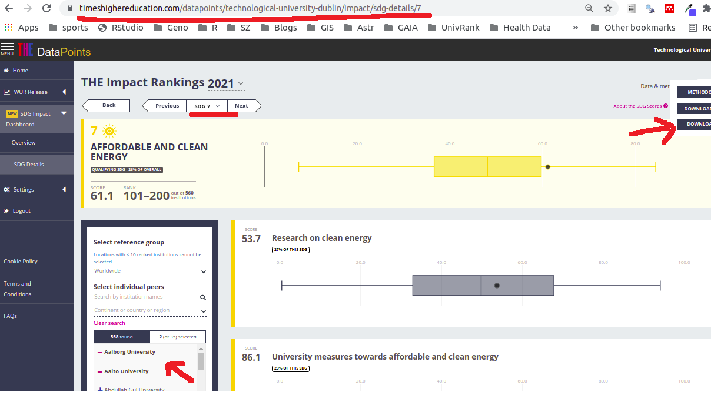

background-image: url(img/work-together.png)
background-position: center
background-size: contain

```{r setup, include=FALSE, echo=FALSE, message=F, warning=F}
options(htmltools.dir.version = FALSE, echo = F, message = F, warning = F)
# http://stla.github.io/stlapblog/posts/Numextract.html

library(tidyverse)
library(tm)
library(ggrepel)
library(leaflet)
library(htmltools)
library(showtext)
library(extrafont)
library(collapsibleTree)
library(gt)
library(kableExtra)
library(patchwork)
library(Rtsne)
library(plotly)

my_font <- "Josefin Slab"
my_font <- "Indie Flower"
font_add_google(my_font, family = my_font)
showtext_auto()
theme_set(theme_minimal() +
            theme(text = element_text(family = my_font, size = 28)))

```

```{r xaringan-extra, echo=FALSE}
library(xaringanExtra)
xaringanExtra::use_panelset()
```

```{r data, echo=FALSE, message=F, warning=F, cache = T}
irish_universities <- tibble(university=
                               c("Technological University Dublin",
                                 "University College Cork",
                                 "Dublin City University",
                                 "University College Dublin",
                                 "Trinity College Dublin",
                                 "Queen’s University Belfast",
                                 "National University of Ireland, Galway",
                                 "University of Limerick",
                                 "Waterford Institute of Technology",
                                 "Maynooth University",
                                 "RCSI University of Medicine and Health Sciences"),
                             abbrev = c("TUD", "UCC", "DCU", "UCD", "TCD", "QUB",
                                        "NUIG", "UL", "WIT", "NUIM", "RCSI"))
cohort_universities <- tibble(university=c("Technological University Dublin",
                         "Cyprus University of Technology",
                         "Riga Technical University",
                         "Aalborg University",
                         "Queensland University of Technology",
                         "Aalto University",
                         "University of Auckland",
                         "UNSW Sydney",
                         "University of Manchester"),
                         abbrev=c("TUD", "Cyprus", "Riga",
                                  "Aalborg", "QUT", "Aalto",
                                  "Auckland", "UNSW", "Manchester"))

zq <- read_csv("../data/working-together/al-qasim/SDG17_2021_readme_weightings_2021_09_09.csv", n_max = 29) %>% 
  mutate(Weight = Weight %>% str_remove("%") %>% as.numeric())

SDG17_WT <- read_csv("../data/working-together/al-qasim/SDG17_2021_readme_weightings_2021_09_09.csv", n_max = 29) %>% 
  mutate(Weight = Weight %>% str_remove("%") %>% as.numeric()) %>% 
  filter(`Attribute Type` == "Indicator") %>% 
  mutate(Indicator = glue::glue("{Attribute}: ({Weight}%)"),
         Metric = c(rep("Research into partnership for the goals (27.1%)", 2),
                    rep("Relationships to support the goals (18.5%)", 5),
                    rep("Publication of SDG reports (27.2%)", 17),
                    rep("Education for the SDGs (27.2%)", 1))) %>% 
  select(Indicator, Metric) %>% 
  mutate(Indicator = str_wrap(Indicator, 10),
         Metric = str_wrap(Metric, 10))

SDG17_WT_metrics <- read_csv("../data/working-together/al-qasim/SDG17_2021_readme_weightings_2021_09_09.csv", n_max = 29) %>% 
  mutate(Weight = Weight %>% str_remove("%") %>% as.numeric()) %>% 
  filter(`Attribute Type` == "Indicator") %>% 
  mutate(Indicator = glue::glue("{Attribute}"),
         Metric = c(rep("Research into partnership for the goals", 2),
                    rep("Relationships to support the goals", 5),
                    rep("Publication of SDG reports", 17),
                    rep("Education for the SDGs", 1))) %>% 
  select(Indicator, Metric)

SDG17_WT$Indicator1 <- str_wrap(SDG17_WT$Indicator, 10)

working_together <- function(filename = "../data/working-together/al-qasim/SDG17_2021_indicator_scores_2021_09_09.csv") {
  z <- read_lines(filename)
  z <- z[-c(1)] %>%
    as_tibble() %>%
    filter(!(str_detect(value, "Worldwide"))) %>%
    mutate(university = value %>% removeNumbers() %>% removePunctuation())
  z
}

SDG17 <- function(df = z1, my_university = irish_universities, metric = "Research into partnership for the goals") {
  variables <- SDG17_WT_metrics %>% 
    filter(Metric == metric) %>% 
    pull(Indicator)
  z2 <- df %>% 
    select(university, 
           variables,
           inverse_ranking) %>% 
    pivot_longer(cols = -c(university, inverse_ranking), values_to = "score") %>% 
    mutate(score = as.numeric(score),
           univ_label = abbreviate(university, 10))
  
  z2 %>% ggplot(aes(name, score)) + 
    geom_boxplot(width = 0.2) + 
    geom_point(data = z2 %>% 
                 filter(university %in% my_university$university) %>% 
                 left_join(my_university), 
               aes(y=score, x=name, color = pal(inverse_ranking)),
               show.legend = F) + 
    geom_text_repel(data = z2 %>% 
                      filter(university %in% my_university$university,
                             university != "Technological University Dublin") %>% 
                      left_join(my_university), 
                    aes(label = abbrev, y = score, 
                        x = name, color = pal(inverse_ranking)),
                    family = my_font,
                    show.legend = F,
                    size = 6,
                    fontface = "bold",
                    max.overlaps = 20) +
    geom_text_repel(data = z2 %>% 
                      filter(university == "Technological University Dublin") %>% 
                      left_join(my_university), 
                    aes(label = abbrev, y = score, 
                        x = name),
                    family = my_font,
                    show.legend = F,
                    size = 10,
                    fontface = "bold",
                    max.overlaps = 20) +
    geom_point(data = z2 %>% 
                 filter(university  == "Technological University Dublin") %>% 
                 left_join(my_university), 
               aes(y=score, x=name),
               size = 3,
               show.legend = F) + 
    ggtitle(label = metric) +
    theme(axis.title = element_blank(),
          legend.position = "none",
          plot.title.position = "plot",
          plot.title = element_text(size=24),
          axis.text.y = element_text(size=12)) + 
    scale_x_discrete(labels = function(x) str_wrap(x, width = 20)) +
    coord_flip()
}

dirs <- list.dirs("../data/working-together") %>% 
  paste0("/SDG17_2021_indicator_scores_2021_09_09.csv")
dirs <- dirs[-1]

z <- map(dirs, working_together) %>% 
  bind_rows() %>% 
  distinct(university, .keep_all = T) %>% 
  arrange(value) %>% 
  mutate(value = value %>% str_replace_all("[//(//)]", ""),
         value = value %>% str_replace_all("([a-z]),([0-9])", "\\1 , \\2")) %>% 
  arrange(value)

column_names <- zq %>% 
  filter(`Attribute Type` == "Indicator") %>% 
  pull(Attribute) %>% 
  c("university", .)

overall <- function(filename = "../data/working-together/al-qasim/SDG17_2021_sdg_overall_2021_09_09.csv") {
  read_lines(skip = 1, file = filename) %>% 
    as_tibble() %>% 
    mutate(score = str_sub(value, -6, -1) %>% parse_number()) %>% 
    separate(col=value, into = c("university", "score1"), sep = ",\\d", remove = F) %>% 
    select(university, score) %>% 
    filter(!(str_detect(university, "Worldwide:")))
}

overall_dirs <- list.dirs("../data/working-together") %>% 
  paste0("/SDG17_2021_sdg_overall_2021_09_09.csv")
overall_dirs <- overall_dirs[-1]

overs <- map(overall_dirs, overall) %>% 
  bind_rows() %>% 
  distinct() %>% 
  arrange(university) %>% 
  mutate(university = university %>% str_replace_all("[//(//)]", "")) %>% 
  mutate(irish = university %in% irish_universities$university,
         cohort = university %in% cohort_universities$university)

geos <- readRDS("../data/working-together/geos")


# geos <- geo(address = overs$university, method = "osm")
geos$university <- overs$university

overs <- overs %>% 
  left_join(geos, by = c("university" = "university")) %>% 
  mutate(ranking = dense_rank(desc(score)),
         inverse_ranking = dense_rank(score),
         label = glue::glue("<b>{university}</b><br/>{score}<br/>{ranking}"))

# Create a continuous palette function
pal <- colorNumeric(
  palette = "Reds",
  domain = overs$inverse_ranking)

# overs %>% leaflet() %>% 
#   addProviderTiles("Esri.NatGeoWorldMap") %>% 
#   addCircleMarkers(popup = ~glue::glue("<b>{university}</b><br/>Score: {round(score, 1)}%<br/>Ranking: {ranking}"),
#                    lng = ~long, 
#                    lat = ~lat,
#                    fill = ~pal(inverse_ranking),
#                    color = ~pal(inverse_ranking))

z1 <- str_remove(z$value, overs$university) %>% 
  str_remove("imputed:") %>% 
  as_tibble() %>% 
  separate(col = value, into = column_names, sep = ",") %>% 
  mutate(university = overs$university,
         ranking = overs$ranking,
         inverse_ranking = overs$inverse_ranking,
         `Research into partnership for the goals` = ((as.numeric(`Proportion of output co-authored with low or lower-middle income countries`) * 13.55 + 
                                                         as.numeric(`Partnership for the goals: publications`) * 13.55) / 27.1) %>% round(1),
         `Relationships to support the goals` = (as.numeric(`Relationships with NGOs and government for SDG policy`) +
           as.numeric(`Cross sectoral dialogue about SDGs`) +
           as.numeric(`International collaboration data gathering for SDG`) +
           as.numeric(`Collaboration for SDG best practice`) +
           as.numeric(`Collaboration with NGOs for SDGs`)) / 5 %>% round(1),
         `Publication of SDG reports` = ((as.numeric(`Publication of SDG report: SDG1`) +
           as.numeric(`Publication of SDG report: SDG2`) +
           as.numeric(`Publication of SDG report: SDG3`) +
           as.numeric(`Publication of SDG report: SDG4`) +
           as.numeric(`Publication of SDG report: SDG5`) +
           as.numeric(`Publication of SDG report: SDG6`) +
           as.numeric(`Publication of SDG report: SDG7`) +
           as.numeric(`Publication of SDG report: SDG8`) +
           as.numeric(`Publication of SDG report: SDG9`) +
           as.numeric(`Publication of SDG report: SDG10`) +
           as.numeric(`Publication of SDG report: SDG11`) +
           as.numeric(`Publication of SDG report: SDG12`) +
           as.numeric(`Publication of SDG report: SDG13`) +
           as.numeric(`Publication of SDG report: SDG14`) +
           as.numeric(`Publication of SDG report: SDG15`) +
           as.numeric(`Publication of SDG report: SDG16`) +
           as.numeric(`Publication of SDG report: SDG17`)) / 17) %>% round(1),
         `Education for the SDGs` = as.numeric(`Education for SDGs commitment to meaningful education`) %>% round(1)) %>% 
  select(university, everything()) %>% 
  left_join(overs, keep = F) %>% 
  mutate(irish_uk = between(lat, 50, 60) & between(lon, -14, 2))


zp <- z1 %>%
  select(university, `Proportion of output co-authored with low or lower-middle income countries`:`Education for SDGs commitment to meaningful education`) %>% 
  pivot_longer(-university, names_to = "Attribute") %>% 
  left_join(zq) %>% 
  mutate(value = as.numeric(value) * Weight / 100) %>% 
  select(university, Attribute, value) %>% 
  pivot_wider(names_from = "Attribute", values_from = "value")

z5 <- Rtsne(zp %>% 
              select(`Proportion of output co-authored with low or lower-middle income countries`:`Education for SDGs commitment to meaningful education`) %>% 
              as.matrix() %>%
              sapply(as.numeric) %>% 
              matrix(nrow = 1153, ncol = 25) %>% 
              normalize_input() %>% 
              dist(), 
            perplexity = 10,
            theta = 0.0)

z6 <- tibble(x = z5$Y[,1], 
       y = z5$Y[,2], 
       label = z1$university, 
       score = z1$score,
       irish_uk = z1$irish_uk,
       irish = z1$irish,
       cohort = z1$cohort)
tud_x <- z6[z6$label == 'Technological University Dublin','x']
tud_y <- z6[z6$label == 'Technological University Dublin','y']

z6 <- z6 %>% 
  mutate(close = between(x, tud_x-8, tud_x+8) & between(y, tud_y-5, tud_y+5))

```


???

Image credit: [Wikimedia Commons](https://commons.wikimedia.org/wiki/File:Sharingan_triple.svg)

---
class: center, middle

# THE University Rankings

## ... working together


---


# Outline


1. Describe Structure of THE - SDG17 - Working Together  

2. Accessing the Data  

3. Comparison Universities  

4. First Look at the Data  

5. Map  

6. Overall Scores  

6. Overall Comparisons

7. Research into partnership for the goals

8. Relationships to support the goals

9. Publication of SDG reports

10. Education for the SDGs

11. Conclusions

---

.panelset[

.panel[
.panel-name[Metrics]

### Click on nodes to expand / collapse

```{r collapsibleTree, echo=FALSE, fig.align='center', fig.width=12}
tree <- collapsibleTree(
  SDG17_WT,
  fontSize = 12,
  linkLength = 100,
  root = "SDG17 Working Together",
  hierarchy = c("Metric", "Indicator"), 
  fill = c(
    # The root
    "seashell",
    # Unique regions
    rep("brown", length(unique(SDG17_WT$Metric))),
   # Unique names per region
    rep("forestgreen", length(unique(paste(SDG17_WT$Indicator, SDG17_WT$Metric))))
  )
)

tree[[1]]$options$margin$left <- 280
tree[[1]]$options$margin$right <- 100
tree

```

] <!-- end of panel -->


.panel[
.panel-name[Webpage]




] <!-- end of panel -->

.panel[
.panel-name[Comparison]

### These are the universities that we'll use to compare to TUD

.pull-left[

```{r irish_unis, echo=FALSE}
irish_universities %>% 
  gt()
```

]

.pull-right[

```{r compare_unis, echo=FALSE}
cohort_universities %>% 
  gt()
```

]


] <!-- end of panel -->

.panel[
.panel-name[Data]

```{r all_data, echo=FALSE}
z3 <- z1 %>% 
  select(university:`Education for the SDGs`)
z2 <- z3 %>% column_to_rownames(var = "university")
z2 <- slice(z2, sample(1:n()))
rownames(z2) <- z3$university
z2 <- select(z2, one_of(sample(names(z2)))) 
names(z2) <- names(z3)[-1]
z2 <- z2 %>% rownames_to_column(var = "university")


z2 %>%
  kable("html") %>%
  kable_styling() %>%
  scroll_box(
    height = "500px",
    box_css = "border: 1px solid #ddd; padding: 5px; ",
    fixed_thead = TRUE
  )
```


] <!-- end of panel -->

.panel[
.panel-name[Map]

- Dark red indicates a high score / click on the circles to see details

```{r map, echo=FALSE, message=F, warning=F, fig.width=10}
z1 %>% leaflet() %>% 
  addProviderTiles("Esri.NatGeoWorldMap") %>% 
  addCircleMarkers(popup = ~glue::glue("<b>{university}</b>
                                       <br/>Score: {round(score, 1)}%
                                       <br/><b>Ranking: {ranking}</b>
                                       <br/>Research into partnership for the goals: {`Research into partnership for the goals`}%
                                       <br/>Relationships to support the goals: {`Relationships to support the goals`}%
                                       <br/>Publication of SDG reports: {`Publication of SDG reports`}%
                                       <br/>Education for the SDGs: {`Education for the SDGs`}%"),
                   lng = ~lon, 
                   lat = ~lat,
                   fill = ~pal(inverse_ranking),
                   color = ~pal(inverse_ranking)) %>% 
  setView(lng = -8, lat = 55, zoom = 4)
```


] <!-- end of panel -->

.panel[
.panel-name[Score]


```{r overall, echo=FALSE, message=F, warning=F, fig.width=10}
irish <- overs %>%
  ggplot(aes(1, score)) +
  geom_violin(fill = "gray80", alpha = 0.5) +
  geom_point(data = overs %>%
               filter(university %in% irish_universities$university),
             aes(y=score, x=1, color = pal(inverse_ranking)),
             show.legend = F,
             size = 5) +
  geom_text_repel(data = overs %>%
                    filter(university %in% irish_universities$university) %>% 
                    left_join(irish_universities),
                  aes(label = abbrev, y = score, x = 1, color = pal(inverse_ranking)),
                  family = my_font,
                  size = 8,
                  show.legend = F) +
  coord_flip() +
  theme(axis.title.y = element_blank(),
        axis.text.y = element_blank())


international <- overs %>% 
  ggplot(aes(1, score)) + 
  geom_violin(fill = "gray80", alpha = 0.5) + 
  geom_point(data = overs %>% 
               filter(university %in% cohort_universities$university), 
             aes(y=score, x=1, color = pal(inverse_ranking)),
             show.legend = F,
             size = 5) + 
  geom_text_repel(data = overs %>% 
                    filter(university %in% cohort_universities$university) %>% 
                    left_join(cohort_universities), 
                  aes(label = abbrev, y = score, x = 1, color = pal(inverse_ranking)),
                  family = my_font,
                  size = 10,
                  show.legend = F,
                  max.overlaps = 20) + 
  coord_flip() +
  theme(axis.title.y = element_blank(),
        axis.text.y = element_blank())

irish / international

```


]<!-- end of panel -->

]<!-- end of panelset -->

---

.panelset[

.panel[
.panel-name[7a]

```{r energy_a, echo=FALSE, message=F, warning=F, fig.width=10}
z2 <- z1 %>% 
  select(university, 
         inverse_ranking,
         `Research into partnership for the goals`, 
         `Relationships to support the goals`, 
         `Publication of SDG reports`,
         `Education for the SDGs`) %>% 
  pivot_longer(cols = -c(university, inverse_ranking), values_to = "score") %>% 
  mutate(score = as.numeric(score),
         univ_label = abbreviate(university, 10),
         name = factor(name, levels = c("Research into partnership for the goals",
                                        "Relationships to support the goals",
                                        "Publication of SDG reports",
                                        "Education for the SDGs")))

z2 %>% ggplot(aes(name %>% fct_rev(), score)) + 
  geom_boxplot(width = 0.2) + 
  geom_point(data = z2 %>% 
               filter(university %in% irish_universities$university) %>% 
               left_join(irish_universities), 
             aes(y=score, x=name, color = pal(inverse_ranking)),
             show.legend = F) + 
  geom_text_repel(data = z2 %>% 
                    filter(university %in% irish_universities$university,
                           university != "Technological University Dublin") %>% 
                    left_join(irish_universities), 
                  aes(label = abbrev, y = score, 
                      x = name, color = pal(inverse_ranking)),
                  family = my_font,
                  show.legend = F,
                  size = 6,
                  fontface = "bold",
                  max.overlaps = 20) +
  geom_text_repel(data = z2 %>% 
                    filter(university == "Technological University Dublin") %>% 
                    left_join(irish_universities), 
                  aes(label = abbrev, y = score, 
                      x = name),
                  family = my_font,
                  show.legend = F,
                  size = 10,
                  fontface = "bold",
                  max.overlaps = 20) +
  geom_point(data = z2 %>% 
               filter(university  == "Technological University Dublin") %>% 
               left_join(irish_universities), 
             aes(y=score, x=name),
             size = 3,
             show.legend = F) + 
  ggtitle(label = "SDG17 - Working Together") +
  theme(axis.title = element_blank(),
        legend.position = "none",
        plot.title.position = "plot",
        plot.title = element_text(size=24),
        axis.text.y = element_text(size=12)) + 
  scale_x_discrete(labels = function(x) str_wrap(x, width = 20)) +
  coord_flip()
```


]<!-- end of panel -->


.panel[
.panel-name[7b]

```{r energy_b, echo=FALSE, message=F, warning=F, fig.width=10}
z2 %>% ggplot(aes(name %>% fct_rev(), score)) + 
  geom_boxplot(width = 0.2) + 
  geom_point(data = z2 %>% 
               filter(university %in% cohort_universities$university) %>% 
               left_join(cohort_universities), 
             aes(y=score, x=name, color = pal(inverse_ranking)),
             show.legend = F) + 
  geom_text_repel(data = z2 %>% 
                    filter(university %in% cohort_universities$university,
                           university != "Technological University Dublin") %>% 
                    left_join(cohort_universities), 
                  aes(label = abbrev, y = score, 
                      x = name, color = pal(inverse_ranking)),
                  family = my_font,
                  show.legend = F,
                  size = 6,
                  fontface = "bold",
                  max.overlaps = 20) +
  geom_text_repel(data = z2 %>% 
                    filter(university == "Technological University Dublin") %>% 
                    left_join(cohort_universities), 
                  aes(label = abbrev, y = score, 
                      x = name),
                  family = my_font,
                  show.legend = F,
                  size = 10,
                  fontface = "bold",
                  max.overlaps = 20) +
  geom_point(data = z2 %>% 
               filter(university  == "Technological University Dublin") %>% 
               left_join(cohort_universities), 
             aes(y=score, x=name),
             size = 3,
             show.legend = F) + 
  ggtitle(label = "SDG17 - Working Together") +
  theme(axis.title = element_blank(),
        legend.position = "none",
        plot.title.position = "plot",
        plot.title = element_text(size=24),
        axis.text.y = element_text(size=12)) + 
  scale_x_discrete(labels = function(x) str_wrap(x, width = 20)) +
  coord_flip()
```

]<!-- end of panel -->


.panel[
.panel-name[8a]

```{r clean_energy_a, echo=FALSE, message=F, warning=F, fig.width=10}
SDG17(my_university = irish_universities)
```

]<!-- end of panel -->

.panel[
.panel-name[8b]

```{r clean_energy_b, echo=FALSE, message=F, warning=F, fig.width=10}
SDG17(my_university = cohort_universities)
```

]<!-- end of panel -->

.panel[
.panel-name[9a]

```{r affordable_energy_a, echo=FALSE, message=F, warning=F, fig.width=10}
SDG17(my_university = irish_universities, metric = "Relationships to support the goals")
```


]<!-- end of panel -->


.panel[
.panel-name[9b]

```{r affordable_energy_b, echo=FALSE, message=F, warning=F, fig.width=10}
SDG17(my_university = cohort_universities, metric = "Relationships to support the goals")
```

]<!-- end of panel -->

.panel[
.panel-name[10a]

```{r use_energy_a, echo=FALSE, message=F, warning=F, fig.width=10}
SDG17(my_university = irish_universities, metric = "Publication of SDG reports")
```


]<!-- end of panel -->


.panel[
.panel-name[10b]

```{r use_energy_b, echo=FALSE, message=F, warning=F, fig.width=10}
SDG17(my_university = cohort_universities, metric = "Publication of SDG reports")
```

]<!-- end of panel -->


.panel[
.panel-name[11a]

```{r community_energy_a, echo=FALSE, message=F, warning=F, fig.width=10}
SDG17(my_university = irish_universities, metric = "Education for the SDGs")
```


]<!-- end of panel -->


.panel[
.panel-name[11b]

```{r community_energy_b, echo=FALSE, message=F, warning=F, fig.width=10}
SDG17(my_university = cohort_universities, metric = "Education for the SDGs")
```

]<!-- end of panel -->

] <!-- end of panelset -->

---

# Conclusions

1. Metrics where we do badly:

    - _Relationships with NGOs and government for SDG policy: (3.7%)_  
    - _Cross sectoral dialogue about SDGs: (3.7%)_  
    - _Collaboration with NGOs for SDGs: (3.7%)_


2. Metrics where we could do better:

    - _Partnership for the goals: publications: (13.55%)_


---

In the plot below, universities that are points closer together are more similar (as measured by [t-SNE](https://en.wikipedia.org/wiki/T-distributed_stochastic_neighbor_embedding)).

.panelset[

.panel[
.panel-name[Irish]

```{r tsne-irish, echo=FALSE, message=F, warning=F, fig.width=10, fig.height=6}
gg=z6 %>% 
  ggplot(aes(x, y, label = label)) + 
  geom_point(aes(col = score), 
             #shape=2, 
             size=0,
             stroke = 5,
             alpha = 0.5,
             show.legend = F) + 
  scale_color_gradient(low = "lightblue1", high = "darkblue") +
  geom_text(data = z6 %>% 
                    filter(irish),
                  aes(x, y, label = label %>% str_wrap(20)),
                  family = my_font, 
                  size = 4, 
                  show.legend = F,
                  colour = "brown4") +
  geom_point(data = z6 %>% 
               filter(irish),
             aes(fill = score), 
             shape=21, 
             size=5,
             stroke = 0,
             alpha = 1,
             show.legend = F) + 
  scale_fill_gradient(low = "brown1", high = "brown4") +
  theme_void() +
  theme(panel.background = element_rect(fill = "snow1"),
        text = element_text(size = 4, face = "bold"))
ggplotly(gg, tooltip = c("score", "label"))
```

]<!-- end of panel -->

.panel[
.panel-name[Cohort]

```{r tsne-cohort, echo=FALSE, message=F, warning=F, fig.width=10, fig.height=6}
gg=z6 %>% 
  ggplot(aes(x, y, label = label)) + 
  geom_point(aes(col = score), 
             #shape=2, 
             size=0,
             stroke = 5,
             alpha = 0.5,
             show.legend = F) + 
  scale_color_gradient(low = "lightblue1", high = "darkblue") +
  geom_text(data = z6 %>% 
                    filter(cohort),
                  aes(x, y, label = label %>% str_wrap(20)),
                  family = my_font, 
                  size = 4, 
                  show.legend = F,
                  colour = "brown4") +
  geom_point(data = z6 %>% 
               filter(cohort),
             aes(fill = score), 
             shape=21, 
             size=5,
             stroke = 0,
             alpha = 1,
             show.legend = F) + 
  scale_fill_gradient(low = "brown1", high = "brown4") +
  theme_void() +
  theme(panel.background = element_rect(fill = "snow1"),
        text = element_text(size = 4, face = "bold"))
ggplotly(gg, tooltip = c("score", "label"))
```

]<!-- end of panel -->

.panel[
.panel-name[Close]

```{r tsne-close, echo=FALSE, message=F, warning=F, fig.width=10, fig.height=6}
z6 %>% 
  ggplot(aes(x, y, label = label)) + 
  geom_point(aes(fill = score), 
             shape=21, 
             size=5,
             alpha = 0.5,
             show.legend = F) + 
  geom_text_repel(data = z6 %>% 
                    filter(close),
                  aes(x, y, label = label %>% str_wrap(20)),
                  family = my_font, 
                  size = 6, 
                  show.legend = F,
                  max.overlaps = 40) +
  geom_point(data = z6 %>% 
               filter(close),
             fill = "red", 
             shape=21, 
             size=2,
             alpha = 1,
             show.legend = F) + 
  scale_color_discrete(aes(close)) +
  scale_fill_gradient(low = "lightblue1", high = "darkblue") +
  theme_void() +
  theme(panel.background = element_rect(fill = "snow1"),
        text = element_text(size = 8))
```
]<!-- end of panel -->

]<!-- end of panelset -->
